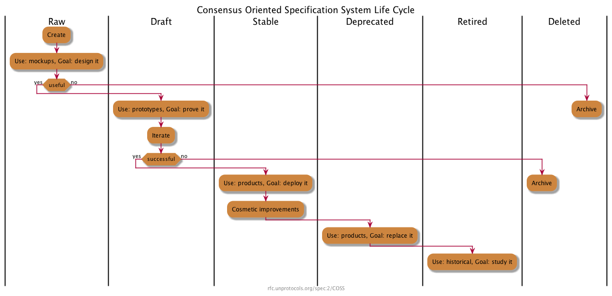

This document describes a consensus-oriented specification system (COSS) for building interoperable technical specifications.
COSS is based on a lightweight editorial process that seeks to engage the widest possible range of interested parties and move rapidly to consensus through working code.

This specification is based on [zkspecs 1/COSS](https://github.com/privacy-ethereum/zkspecs/tree/main/specs/1) and, through it, [Unprotocols 2/COSS](https://github.com/unprotocols/rfc/blob/master/2/README.md), used by the [ZeroMQ](https://rfc.zeromq.org/) project.
It is equivalent except for some areas:

- a git repository model replaces the wiki model for editing and publishing specifications;
- standards track specifications MUST be based on the domain's specification template;
- lifecycle transitions are tied to explicit artifacts (see "COSS Lifecycle");
- miscellaneous metadata, editor, and format/link updates.

This EthSystems adaptation was revised on 2026-09-09.

## License

Copyright (c) 2008-26 the Editor and Contributors.

This Specification is free software;
you can redistribute it and/or modify it under the terms of the GNU General Public License as published by the Free Software Foundation;
either version 3 of the License, or (at your option) any later version.

This Specification is distributed in the hope that it will be useful, but WITHOUT ANY WARRANTY;
without even the implied warranty of MERCHANTABILITY or FITNESS FOR A PARTICULAR PURPOSE.
See the GNU General Public License for more details.

A copy of the GNU General Public License is included in [COPYING](./COPYING).

## Change Process

This document is governed by [1/COSS](../1).

## Language

The key words "MUST", "MUST NOT", "REQUIRED", "SHALL", "SHALL NOT", "SHOULD", "SHOULD NOT", "RECOMMENDED", "MAY", and "OPTIONAL" in this document are to be interpreted as described in
[RFC 2119](http://tools.ietf.org/html/rfc2119).

## Goals

The primary goal of COSS is to facilitate the process of writing, proving, and improving new technical specifications.
A "technical specification" defines a protocol, a process, an API, a use of language, a methodology,
or any other aspect of a technical environment that can usefully be documented for the purposes of technical or social interoperability.

COSS is intended to above all be economical and rapid, so that it is useful to small teams with little time to spend on more formal processes.

Principles:

* We aim for rough consensus and running code; [inspired by the IETF Tao](https://www.ietf.org/about/participate/tao/).
* Specifications are small pieces, made by small teams.
* Specifications should have a clearly responsible editor.
* The process should be visible, objective, and accessible to anyone.
* The process should clearly separate experiments from solutions.
* The process should allow deprecation of old specifications.

Specifications should take minutes to explain, hours to design, days to write, weeks to prove, months to become mature, and years to replace.

Specifications have no special status except that accorded by the community.

## Architecture

COSS is designed around fast, easy to use communication tools.
Primarily, COSS uses a git repository model for editing and publishing specification texts.

* The *domain* is the conservancy for a set of specifications in a certain area.
* Each domain is implemented as a git repository on a public forge.
* Each specification is a directory `specs/<number>/` containing a `README.md`,
  together with diagrams, test vectors, proofs, and other resources.

The copyright, patent, and trademark policies of the domain must be clarified in an Intellectual Property policy that applies to the domain.

Specifications are assigned an incremental number when they are first merged.
Thus, we refer to a specification by specifying its domain, number, and short name.
New versions of the same specification will have new numbers.
The syntax for a specification reference is:

    <domain>/<number>/<shortname>

For example, this specification is **ethsystems/specs/1/COSS**.
The short form **1/COSS** may be used when referring to the specification from other specifications in the same domain.

Every specification (including branches) carries a different number.

## COSS Lifecycle

Every specification has an independent lifecycle that documents clearly its current status.

A specification has six possible states that reflect its maturity and contractual weight:

### Raw Specifications

All new specifications are **raw** specifications.
Changes to raw specifications can be unilateral and arbitrary.
Those seeking to implement a raw specification should ask for it to be made a draft specification.
Raw specifications have no contractual weight.

A raw specification MUST be complete against the domain's specification template before it is merged.

### Draft Specifications

When raw specifications can be demonstrated, they become **draft** specifications.
In this domain, demonstration means that a reference implementation exists and that the specification has passed an adversarial review.
Changes to draft specifications should be done in consultation with users.
Draft specifications are contracts between the editors and implementers.

### Stable Specifications

When draft specifications are used by third parties, they become **stable** specifications.
In this domain, third-party use means an independent implementation or a production deployment.
Changes to stable specifications should be restricted to cosmetic ones, errata and clarifications.
Stable specifications are contracts between editors, implementers, and end-users.

### Deprecated Specifications

When stable specifications are replaced by newer draft specifications, they become **deprecated** specifications.
Deprecated specifications should not be changed except to indicate their replacements, if any.
Deprecated specifications are contracts between editors, implementers and end-users.

### Retired Specifications

When deprecated specifications are no longer used in products, they become **retired** specifications.
Retired specifications are part of the historical record.
They should not be changed except to indicate their replacements, if any.
Retired specifications have no contractual weight.

### Deleted Specifications

Deleted specifications are those that have not reached maturity (stable) and were discarded.
They should not be used and are only kept for their historical value.
Only Raw and Draft specifications can be deleted.

## Editorial control

A specification MUST have a single responsible editor,
the only person who SHALL change the status of the specification through the lifecycle stages.

A specification MAY also have additional contributors who contribute changes to it.
It is RECOMMENDED to use a process similar to [C4 process](https://github.com/unprotocols/rfc/blob/master/1/README.md)
to maximize the scale and diversity of contributions.

Protocol specifications in this domain MUST use [CC0 1.0](../../LICENSE).
Contributions MUST use the license of the document being changed.
Following this editorial process does not change the license of a specification.

The editor is responsible for accurately maintaining the state of specifications and for handling all comments on the specification.

## Branching and Merging

Any member of the domain MAY branch a specification at any point.
This is done by copying the existing text, and creating a new specification with the same name and content, but a new number.
The ability to branch a specification is necessary in these circumstances:

* To change the responsible editor for a specification, with or without the cooperation of the current responsible editor.
* To rejuvenate a specification that is stable but needs functional changes.
  This is the proper way to make a new version of a specification that is in stable or deprecated status.
* To resolve disputes between different technical opinions.

The responsible editor of a branched specification is the person who makes the branch.

Rights and obligations for external branches follow the license of the specification.
CC0 does not require external contributors to publish their changes or offer them back to this repository.

Technically speaking, a branch is a *different* specification, even if it carries the same name.
Branches have no special status except that accorded by the community.

## Conflict resolution

COSS resolves natural conflicts between teams and vendors by allowing anyone to define a new specification.
There is no editorial control process except that practised by the editor of a new specification.
The administrators of a domain (moderators) may choose to interfere in editorial conflicts,
and may suspend or ban individuals for behaviour they consider inappropriate.

## Specification Structure

### Meta Information

Specifications MUST contain the following metadata.
It is RECOMMENDED that specification metadata is specified as a YAML header (where possible).
This will enable programmatic access to specification metadata.

| Key              | Value                | Type   | Example                                 |
|------------------|----------------------|--------|-----------------------------------------|
| **shortname**    | short name           | string | 1/COSS                                  |
| **title**        | full name            | string | Consensus-Oriented Specification System |
| **status**       | status               | string | draft                                   |
| **category**     | category             | string | Best Current Practice                   |
| **tags**         | 0 or several tags    | list   | shielded-pool, compliance               |
| **editor**       | editor name/email    | string | Oskar Thoren <oskar@ethsystems.org>     |
| **contributors** | contributors         | list   | - Pieter Hintjens <ph@imatix.com>       |

### Specification Template

Standards Track specifications MUST be based on the domain's [specification template](../../template/README.md).
Informational and Best Current Practice specifications MAY deviate from the template where its structure does not apply.

## Conventions

Where possible editors and contributors are encouraged to:

* Refer to and build on existing work when possible, especially IETF specifications.
* Contribute to existing specifications rather than reinvent their own.
* Use collaborative branching and merging as a tool for experimentation.
* Use Semantic Line Breaks: https://sembr.org/.

## Appendix A. Color Coding

It is RECOMMENDED to use color coding to indicate specification's status. Color coded specifications SHOULD use the following color scheme:

* 
* 
* 
* 
* 
* 
