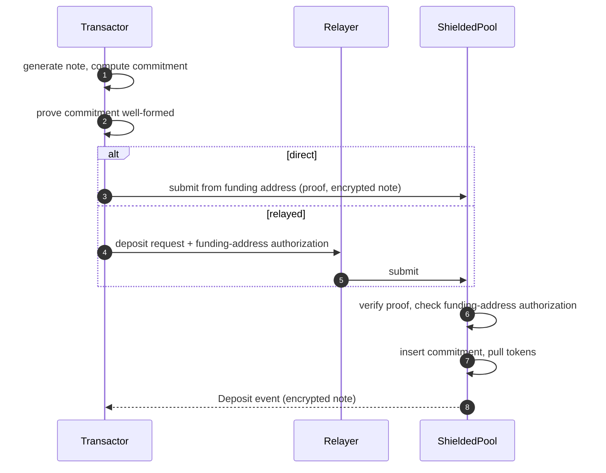
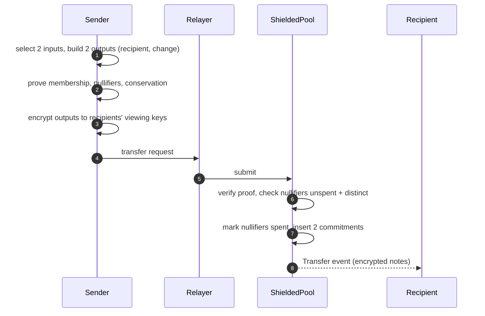
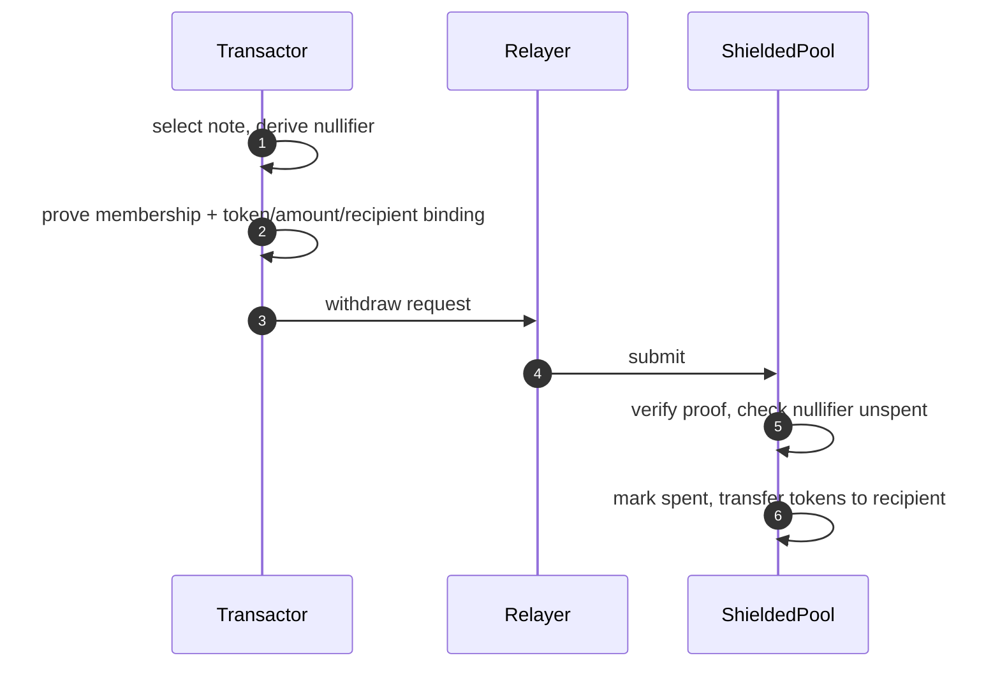

This document specifies a shielded pool for confidential ERC-20 payments on Ethereum.
Funds exist as private notes, committed on-chain and spent via nullifiers, hiding transfer amounts and counterparties from public observers, while viewing keys enable selective disclosure to auditors.
Entry and exit are public, and this core applies no control over who may enter.
Named extension points let a profile add entry or flow control without forking the machinery; [3/ATTESTED-POOL](../3) is the attestation-gated entry profile.

## 1. Introduction

### 1.1 Motivation

Institutional payment flows on public blockchains expose sensitive operational data: treasury positions and movement patterns, supplier relationships through payment destinations, settlement timing that reveals trading strategies, and aggregated on-chain data that enables competitor analysis.
Institutions require payment privacy comparable to traditional banking while operating on public infrastructure.

This document specifies the pool machinery those flows need, and nothing above it: UTXO notes, an append-only commitment tree, a nullifier set, in-circuit value conservation, and a public deposit and withdraw boundary.
Control over who may enter, and over what moves inside, attaches at the extension points of Section 5.5 instead of being written into the pool.
Separating the two is what makes a control claim checkable: a gate is only separable if the ungated core is specified.

### 1.2 Constraints

- Privacy: for in-pool transfers, amounts, counterparties, and payment linkage MUST be hidden from public observers.
  Deposit and withdrawal amounts, tokens, and withdrawal recipients are public.
  Transaction existence remains visible.
- Regulatory: viewing keys MUST enable selective disclosure for audit and monitoring.
  This core places no condition on entry; a deployment subject to customer due diligence composes an entry profile (Section 5.5).
- Operational: settlement in minutes.
  Compatible with existing ERC-20 tokens without issuer modifications.
  Deployable on Ethereum L1.
- Trust: relayers MUST NOT be able to steal funds or to link a note's input to its output; they do observe submission metadata (Section 6.1).
  Viewing-key holders get read-only access.

### 1.3 Relationship to Existing Standards

- Zcash Sapling/Orchard define both the note-commitment-nullifier shielded pool model and the dual-key separation of spending and viewing authority that this protocol builds on, but target a native asset on a dedicated chain rather than ERC-20 tokens on Ethereum.
- Tornado Cash, Railgun, and Privacy Pools bring shielded pools to Ethereum.
  Railgun's Private Proofs of Innocence screen funds after entry: a user proves non-membership in a blocklist.
  Broadcasters, Railgun's submission parties similar to relayers, check the proof off-chain.
  Privacy Pools generalizes this to association sets: a user proves membership in any published set, inclusion or exclusion.
  The deployed v1 verifies the proof on-chain at withdrawal.
  Its documented v2 (testnet as of September 2026) instead gates every private spend on association-set approval.
  Each fixes one screening placement in its own design.
  This document fixes none, and names the points at which a profile attaches a check at entry or on in-pool flow.
- Deployed shielded pools share five invariants and diverge on nearly everything below them.
  Appendix A records that comparison against primary sources, and classifies each system by where it places its screening check.

No open specification writes the shielded-pool core on Ethereum as a control-neutral document with named extension points.
This document enables composition of profiles based on compliance / business requirements.
Protocol-relevant parts may later be upstreamed as an ERC; this document is the working specification.

### 1.4 Control Profile

Ethereum is permissionless.
The base layer applies no control over who transacts.
A confidential system built on it adds the control its trust context needs, and no more.
This document calls that dimension the control axis and specifies one point on it.

A shielded pool has three reference points:

| Control | What it adds over the permissionless base | Specification |
|---|---|---|
| None (sovereign) | Nothing: anyone deposits, transfers, and withdraws | This specification |
| Entry (attested) | Only attested keys may deposit; in-pool transfer and withdrawal stay open | [3/ATTESTED-POOL](../3) |
| Flow (monitored) | Entry control, plus in-pool policy and an audit channel | Separate monitoring specification, pending promotion (Section 7.2) |

The three points share one pool core, and this document is that core.
The note, commitment, nullifier, and conservation machinery of Sections 4 and 5 is identical across them.
They differ only in the membership and disclosure checks above that core, which attach at the extension points of Section 5.5.

Which point fits follows the trust context, along the i2i and i2u distinction the map draws for the [shielding pattern](https://github.com/ethsystems/map/blob/master/patterns/pattern-shielding.md).
Between institutions (i2i), the participants are peers with legal recourse, and entry control defines a membership rather than a censor: it excludes no party the members did not agree to exclude.
For a service to end users (i2u), entry control concentrates power in an operator who can exclude a user, so credible neutrality and a working exit weigh more.
This document specifies the neutral point, and the machinery the other two are built on.
It names its neighbors so an implementer sees the whole axis, and specifies only itself.

Deployed as written, this core admits anyone.
It is not by itself an institutional deployment target: an institution that requires entry control deploys it under 3/ATTESTED-POOL, and one that requires in-pool policy composes the compliance-monitoring extension as well.

### 1.5 Out of Scope

- Entry and flow control: who may deposit, and what policy applies to in-pool transfers, are specified by profiles over the extension points of Section 5.5, not here.
- Network-layer metadata: IP addresses, submission timing, and gas-payer identity are out of scope for the shielding layer.
  Deployments SHOULD compose network-level anonymity to cover them.
  Application-payload metadata is not covered: an anonymizing transport cannot remove a linkable identifier that the delivery payload itself carries (Section 5.4).
- State-read metadata: fetching a note's Merkle path or scanning for incoming notes through shared RPC or indexer infrastructure reveals to that operator which note is about to be spent or read.
  Out of scope here; addressed by the nullifier-scaling extension (private information retrieval, PIR), or sidestepped by institutions running their own node and indexer.
- Assets other than ERC-20: the mechanics generalize to any transferable asset, but this specification scopes to ERC-20.
- Multi-asset atomic settlement (payment versus payment / delivery versus payment, PvP/DvP): transfers are single-token by construction (Section 5.3).
  Atomic two-asset settlement is a planned extension, not part of this core.
- In-pool flow monitoring and policy enforcement: specified by the compliance-monitoring extension (Section 7.2).

## 2. Conventions and Terminology

The key words "MUST", "MUST NOT", "REQUIRED", "SHALL", "SHALL NOT", "SHOULD", "SHOULD NOT", "RECOMMENDED", "MAY", and "OPTIONAL" in this document are to be interpreted as described in BCP 14 [RFC 2119](https://www.rfc-editor.org/info/rfc2119) [RFC 8174](https://www.rfc-editor.org/info/rfc8174) when, and only when, they appear in all capitals.

- **Note**: a private representation of token ownership: token, amount, owner public key, and salt.
- **Commitment**: a hash of a note, published on-chain without revealing note contents.
- **Nullifier**: a unique value derived from a commitment and its owner's spending key; publishing it spends the note.
- **Shielding / unshielding**: converting public ERC-20 tokens into a note (deposit), and back (withdraw).
- **Spending key**: the private key that authorizes spending notes and derives nullifiers.
- **Viewing key**: the private key that decrypts notes for read-only access; the selective-disclosure capability.
- **Sender / recipient**: transfer-local roles of transactors: the sender spends input notes; a recipient owns an output note.
- **Ballast note**: a zero-value note padding a transfer's second input slot.
  Constrained like a real input except for Merkle inclusion (Section 5.3).
- **Commitment tree**: the append-only Merkle tree of all note commitments.
- **Relayer**: a party submitting transactions on behalf of transactors, paying gas and providing submission-timing privacy.
- **Transactor**: an institutional participant transacting in the pool, identified by its spending public key.
- **Profile**: a specification that instantiates the extension points of Section 5.5, adding checks over this core without changing its machinery.

`PoseidonN` denotes the Poseidon hash over BN254 at arity N.
Each argument count MUST instantiate a distinct permutation width with its own round constants.
An implementation MUST NOT realize a lower arity by zero-padding into a wider permutation: `Poseidon(a, b)` would then merge with `Poseidon(a, b, 0, 0)`, and internal Merkle-tree nodes would open as notes.
Arity separation does not separate same-arity uses, so a profile that adds a second Poseidon4 use or a second tree inherits this concern: a per-use domain tag is reserved (Section 6.3) and MUST be pinned before any shared-tree or shared-code variant.

## 3. Architecture

### 3.1 Participants and Roles

| Role | Description | Keys held |
|------|-------------|-----------|
| Transactor | Institutional user performing shielded payments | Spending key, viewing key |
| Relayer | Submits transactions on behalf of transactors | Relayer signing key |
| Regulator / auditor | Observer granted viewing keys for audit | Granted viewing keys |

### 3.2 Trust Model

- A public observer sees all on-chain data: commitments, nullifiers, tree roots, transaction existence and timing.
  It learns neither transfer amounts, nor owners, nor the link between a spent note and its commitment.
- A relayer can delay, reorder, or refuse transactions.
  It cannot steal funds or produce valid proofs; a transactor can switch relayers or submit directly.
- A viewing-key holder reads all notes addressed to that key, past and future.
  It cannot spend.
- The proving system is trusted for soundness and for zero knowledge: soundness underwrites every integrity guarantee, zero knowledge underwrites confidentiality and unlinkability.
  The hash function is trusted for collision and preimage resistance.
  The contract owner's powers are enumerated and constrained per Section 6.1.

### 3.3 Overview

The protocol composes three mechanisms:

1. **UTXO notes** (unspent-transaction-output model).
   Funds exist as note commitments in an append-only Merkle tree, spent by publishing nullifiers.
   Transfers consume input notes and create output notes with no public link between them.
2. **Dual-key selective disclosure.**
   The spending key authorizes transfers; a separate viewing key decrypts notes.
   Institutions can hand a viewing key to an auditor without surrendering custody.
3. **Relayer abstraction.**
   Third parties submit transactions, decoupling gas payment and submission metadata from the transacting institution.
   Relayer use is OPTIONAL: any transactor MAY submit directly.
   A transactor that submits directly pays gas from its own address, which publicly links that address to the pool operation and forfeits entry-to-exit unlinkability.

Entry is open: anyone may deposit, transfer, and withdraw.
Control attaches at the named extension points of Section 5.5 rather than by forking this document.
An entry predicate is a conjunct of the deposit statement, a flow predicate a conjunct of the transfer statement, and either may read an on-chain registry.
A membership check in the deposit statement is architecturally separable from everything under it, which is where this document and its profiles divide.

[3/ATTESTED-POOL](../3) composes an eligibility gate with this core.
Separate PoC drafts describe compliance monitoring and nullifier scaling; neither is promoted into this specification (Section 7).

### 3.4 Protocol Phases

1. Deposit: a participant shields ERC-20 tokens into a note.
2. Transfer: participants pay each other inside the pool, unlinkably.
3. Withdraw: a participant unshields a note back to a public ERC-20 balance.
4. Audit: a viewing key discloses a participant's notes to an authorized reader.

## 4. Protocol Operations

### 4.1 Deposit (Shielding)



1. [transactor] Generate a note (token, amount, an owner spending public key, fresh random salt) and compute its commitment.
   The owner key MAY be the depositor's own or a recipient's (Section 5.3).
   Encrypt the note to the owner's viewing key.
   Nothing binds an owner spending key to a viewing key (Section 6.3), and no shielded address format is specified (Section 7.4).
   A depositor shielding to a recipient therefore obtains that recipient's viewing public key out of band.
2. [transactor] Generate a proof for the deposit statement (Section 5.3): the commitment is well-formed over the deposited token and amount.
3. [transactor] Approve the ERC-20 transfer and submit the deposit from the funding address, or sign a deposit authorization and send it to a relayer.
4. [relayer] Submit the transaction, if a relayer is used.
5. [contract] Verify the proof and check that the funding address authorized the deposit (Section 5.3); on failure, revert.
6. [contract] Append the commitment to the commitment tree, emit a deposit event carrying the encrypted note, and transfer tokens from the funding address into the pool.
   Insertion and event precede the external call, per Section 4.4.
   Where the owner key is a recipient's, that recipient MUST apply the check of Section 4.2 step 3 before treating the note as received.

### 4.2 Private Transfer

Transfers are 2-input-2-output; this shape is normative for this core, and variable arity is a future extension.
A transfer with one real input pads the second with a ballast note (a zero-value note).



1. [sender] Select two input notes (padding with a ballast note if needed) and create two output notes: recipient and change.
   Every created or padded note MUST carry a fresh random salt.
2. [sender] Compute input nullifiers and output commitments, and generate a proof for the transfer statement (Section 5.3).
3. [sender] Encrypt each output note to its recipient's viewing key and send the request to a relayer.
   A recipient MUST NOT treat a note as received until its decrypted contents recompute to a commitment present on-chain; a garbled or fabricated payload otherwise credits a note that cannot be spent or that never existed.
4. [relayer] Submit the transaction.
5. [contract] Verify the proof; check both nullifiers are unspent and pairwise distinct; on failure, revert.
6. [contract] Mark the nullifiers spent, append both output commitments in public-input order (the tree is positional, so the order is normative), and emit a transfer event carrying the encrypted notes.

### 4.3 Withdraw (Unshielding)



1. [transactor] Select a note, compute its nullifier, and generate a proof for the withdraw statement (Section 5.3) binding token, amount, and recipient address.
2. [transactor] Send the request to a relayer (or submit directly).
3. [relayer] Submit the transaction.
4. [contract] Verify the proof; check the nullifier is unspent; on failure, revert.
5. [contract] Mark the nullifier spent, transfer tokens to the recipient address, and emit a withdraw event.

### 4.4 Contract-Side Requirements

- The contract MUST maintain a bounded window of historical commitment-tree roots and accept proofs against any root in the window.
  Accepting a historical root is sound because double-spending is prevented by the nullifier set, not by root freshness.
  A window of 100 roots is RECOMMENDED.
  The root recorded after the final insertion of each operation enters the window; intermediate roots do not.
- The contract MUST reject insertion of a commitment already present in the tree.
  Nullifiers are position-independent, so two identical commitments would share one nullifier and the second note would be unspendable.
- Deposits MUST require the token to be in the supported set; removing a token MUST NOT block transfers or withdrawals of existing notes.
  Tokens whose received amount can differ from the transfer argument (fee-on-transfer, rebasing) MUST NOT be supported: the pool accounts notes at face value, and a shortfall leaves the pool insolvent for the last withdrawer.
- Each operation's encrypted payload MUST be bound to its proof: the statement carries a payload commitment as the last public input (unconstrained in-circuit, like the withdraw recipient), and the contract MUST compute it from the submitted payload (Section 5.4) and pass that value to the verifier.
  Without the binding, a relayer can garble the payload: the operation lands, but the recipient never learns the note contents and the funds are unspendable.
- Deposits and withdrawals MUST reject `amount == 0`; zero-value operations are tree-growth griefing.
- The contract MUST reject any field-typed public input at or above the proof system's field modulus.
  Verifiers consume public inputs modulo the field, while the nullifier set is keyed by the raw encoding; without this check a prover submits `nullifier + p`, presenting the same field element to the verifier and an unseen key to the nullifier set, and double-spends.
- Commitment insertion MUST be reachable only from constrained mint sites: every insertion is asserted equal to a hash image over proof-constrained parts.
  Accepting an output commitment as a free witness breaks every property built on the tree.
- Every commitment insertion and the event announcing it MUST complete before any external call (such as the token transfer) in the same operation.
  Under a token with transfer hooks, a reentrant call can otherwise interleave insertions ahead of the outer call's event, permanently diverging log-order replay from the tree.
  Withdrawals insert nothing, so the order of the token transfer and the withdraw event is unconstrained.
- All entry points MUST be non-reentrant.
- Events MUST carry enough data (commitments, nullifiers, encrypted notes) for a client to reconstruct the commitment tree and spent set from logs alone.

## 5. Data Formats

### 5.1 Data Structures

Key derivation:

```
spending_key    = random()
viewing_key     = random()
spending_pubkey = Poseidon1(spending_key)      // used in commitments
viewing_pubkey  = derive_pubkey(viewing_key)   // encrypted note delivery
```

The reference implementation derives the viewing key pair on secp256k1.

Note, commitment, nullifier:

```
Note {
    token:        address   // ERC-20 token contract
    amount:       u128      // raw token units
    owner_pubkey: Field     // spending public key of owner
    salt:         Field     // fresh random value, hiding
}

commitment = Poseidon4(token, amount, owner_pubkey, salt)
nullifier  = Poseidon2(commitment, spending_key)
```

Only the spending-key holder can compute the nullifier, which spends the commitment without revealing which commitment was spent.

### 5.2 On-Chain State

- Commitment tree: an append-only incremental Merkle tree of note commitments, with a bounded historical-root window (Section 4.4).
- Commitment-seen set: a mapping from commitment to inserted status, which answers the duplicate check of Section 4.4.
  Append-only.
- Nullifier set: a mapping from nullifier to spent status.
  Append-only.
- Supported-token set and verifier reference, governed as Section 3.2 requires.

### 5.3 Proof Statements

Where a statement derives an owner key and a nullifier from one spending key, `spending_key` MUST be a single witness variable feeding both derivations.
Independent per-use equality constraints in this position are a historically shipped soundness bug.

Merkle proofs carry an explicit length and MUST range-check it against the tree's maximum depth (`proof_length <= MAX_DEPTH`); the check is required even when the underlying library clamps or ignores out-of-range lengths.
Proofs opened independently (the two transfer inputs) MUST NOT share one length.

Every amount witness in every statement MUST be range-checked to the note amount width (u128), and amount sums MUST use non-wrapping arithmetic.
Conservation over unchecked field elements permits minting by modular overflow.
The contract MUST reject any public amount at or above 2^128.
Public amounts that enter the circuit as field elements (deposit, withdraw) MUST be range-checked in-circuit as well; the contract check is not a substitute, because the verifier consumes the value modulo the field.

**Deposit statement.**
Public, in this order: commitment, token, amount, funding address, payload commitment.
The proof attests:

1. `commitment == Poseidon4(token, amount, owner_pubkey, salt)`

`owner_pubkey` is a free witness.
A depositor MAY therefore mint a note to a key it does not control, shielding straight to a recipient.
This is legitimate in this core: the deposit's token and amount are public, the funds leave the depositor's own funding address, and the note is spendable only by the key it names.
A profile that conditions entry on a property of the owner key constrains it at E1 (Section 5.5).

The funding address is a public input bound to the proof but not constrained in-circuit.
The contract MUST pull tokens only from the funding address bound in the proof, and MUST require that the funding address authorized this deposit: either `msg.sender == funding_address`, or a signature by the funding address over the deposit's public inputs, the chain id, and the pool address.
An outstanding ERC-20 allowance alone is not authorization: the funding address is a free public input, so any party could otherwise deposit against another address's allowance and mint a note it owns at that address's expense.
The reference implementation uses the `msg.sender` form; relayed deposits require the signature form.

**Transfer statement.**
Public, in this order: two nullifiers, two output commitments, commitment root, payload commitment.
The proof attests, with `owner_pubkey == Poseidon1(spending_key)`:

1. Each input commitment is well-formed over its note fields and `owner_pubkey`, and is a member of the tree at the public commitment root.
2. Each public nullifier equals `Poseidon2(commitment_in, spending_key)`.
3. Each output commitment is well-formed over its note fields.
4. Value conservation: the sum of input amounts equals the sum of output amounts.
5. Token consistency: all notes reference the same token.

For a ballast input (the padded zero-value note), the circuit MUST still constrain the commitment's shape and the nullifier's derivation under the sender's own spending key, and MUST skip only the Merkle inclusion check.
Leaving a ballast nullifier unconstrained lets a prover mark arbitrary values spent.
Whether an input is ballast MUST be derived in-circuit from `amount == 0`; a free selector witness would let a prover skip membership for a nonzero note.
A ballast input carries the sender's own key, the transaction's token, and a fresh random salt.

**Withdraw statement.**
Public, in this order: nullifier, token, amount, recipient, commitment root.
The proof attests:

1. `owner_pubkey == Poseidon1(spending_key)`
2. `commitment == Poseidon4(token, amount, owner_pubkey, salt)` and the commitment is a member of the tree at the public commitment root.
3. `nullifier == Poseidon2(commitment, spending_key)`

`recipient` is a public input bound to the proof but not constrained in-circuit; the contract reads it to route funds.
Withdraw carries no encrypted payload and therefore no payload commitment.

The public-input order above is normative: a verifier consumes the inputs positionally, and two implementations that disagree on the order cannot verify each other's proofs.

### 5.4 Cryptographic Profile

| Primitive | Instantiation | Usage |
|-----------|---------------|-------|
| Hash | Poseidon over BN254, distinct permutation per arity (Section 2) | Commitments, nullifiers, Merkle trees |
| Note encryption | ECDH + HKDF + AEAD (ChaCha20-Poly1305) over a fixed-length canonical plaintext | Encrypted note delivery to viewing keys |
| Merkle trees | LeanIMT (append-only, dynamic depth); commitment tree max depth 32 | Membership proofs |
| Payload commitment | `keccak256(payload) mod p`, with `p` the BN254 scalar-field modulus, so the value is a canonical field element | Binding the encrypted payload to the proof (Section 4.4) |
| Proving system | UltraHonk (reference; any EVM-verifiable zk-SNARK with equivalent soundness MAY be substituted) | All proof statements |

Two conforming implementations MUST produce identical commitments, nullifiers, tree roots, and payload commitments for identical inputs; the hash and tree instantiations above are therefore normative for interoperability, while the proving system is a deployment choice.
The payload commitment is computed over the exact bytes submitted on-chain; the reduction modulo `p` loses over two bits of the digest, which does not materially weaken the binding.

The note-encryption plaintext MUST be fixed-length and canonical, so a ciphertext's length reveals nothing about the note amount, and the note's commitment MUST be bound as associated data.
The delivery payload MUST NOT carry a persistent linkable identifier such as the recipient's viewing public key: an anonymizing transport does not remove an application-layer identifier that ties a recipient to a specific on-chain commitment.
The exact encoding remains unspecified (Section 7.4).

### 5.5 Extension Points

A profile adds control over this core by instantiating the extension points below.
A profile MUST NOT weaken any requirement of this document, and MUST NOT change the note, commitment, nullifier, tree, or conservation rules of Sections 4.4 and 5.1 through 5.4.
It strengthens proof statements, adds on-chain state together with the contract rules and operations that govern it, and adds public inputs; it does nothing else.

A profile MUST NOT publish, as a public input or otherwise, any witness that a guarantee of Section 6.2 depends on keeping hidden from public observers.
The integrity guarantees of Section 6.2 (no double-spend, value conservation) rest on machinery a profile MUST NOT change, so a profile cannot weaken them.
A profile MAY narrow a privacy guarantee (confidentiality, unlinkability, selective disclosure) by disclosing to a party it names, and MUST state each such narrowing in its own Section 6.2.

| Point | What a profile MAY add |
|---|---|
| E1 | A conjunct of the deposit statement (Section 5.3). Entry predicates attach here |
| E2 | A conjunct of the transfer statement (Section 5.3). In-pool flow predicates attach here |
| E3 | A registry contract, read by the predicates of E1 and E2 alongside the state of Section 5.2, with its own governance and its own tree parameters |
| E4 | Public inputs carrying the roots and parameters those predicates need |

A profile that uses E4 MUST restate in full the extended public-input order of every statement it touches.
Added inputs are appended after the inputs this document defines for that statement, except that where a statement carries a payload commitment, that input MUST remain last (Section 4.4).

A conformance claim is a pair.
An implementation conforms to this document when it satisfies every requirement of this document, with the statements of Section 5.3 unweakened; it conforms to a profile when it also satisfies that profile's instantiation.
A gated deployment never exposes an ungated deposit, so its claim reads "conforms to 2/SHIELDED-POOL under profile 3/ATTESTED-POOL".
Such a claim asserts the machinery, the base statements, and the integrity guarantees; which privacy guarantees hold, and toward whom, is stated by the profile's Section 6.2, not implied by the claim.
This document owns the machinery test vectors: commitment, nullifier, tree roots, public-input order, and the base deposit, transfer, and withdraw statements.
Each profile owns the vectors for its own conjuncts.

## 6. Security Considerations

### 6.1 Threat Model

| Adversary | Capabilities | Mitigation |
|-----------|--------------|------------|
| Public observer | Sees all on-chain state and traffic | Commitments hide note contents; nullifiers are unlinkable to commitments without the spending key |
| Malicious relayer | Delays, reorders, or refuses transactions; sees the submitted public data (proof, nullifiers, commitments, encrypted blobs) and the submitter's network identity, so it can link an IP to shielded activity | Cannot forge proofs, steal funds, or read note contents; payload binding (Section 4.4) prevents it from altering encrypted payloads; transactors switch relayers, run their own, or route through anonymizing transport |
| Compromised viewing key | Decrypts all notes for that key, past and future | Read-only; cannot spend. Distribution and rotation are deployment policy (see 6.3) |
| Network observer | Correlates submission metadata (IP, timing) | Out of scope for this layer; deployments SHOULD route submission through anonymizing transport |
| Contract owner / governance | With a mutable verifier, can install an accept-everything verifier and mint or drain the pool; controls supported tokens | A deployment MUST enumerate owner powers and put verifier changes behind a timelock and multi-party control, or make the verifier immutable and migrate by redeployment. Every guarantee in 6.2 is conditional on these controls |

### 6.2 Guarantees

Each guarantee is marked by its current verification level: asserted (designed for and reviewed, not verified), tested (covered by implementation tests), or machine-checked (formally proven).
"Asserted" is a design claim, not a verified one: the level tracks the design, and each implementation additionally states which guarantees its own build satisfies.
"Tested" names the reference implementation's tests (Section 7.1) that exercise the property, including its negative cases.
That implementation runs this core under 3/ATTESTED-POOL, so its deposit circuit is stricter than the deposit statement of Section 5.3 and does not exercise it; the levels below rest on the machinery its tests do cover (Section 7.1).

| Property | Statement | Level |
|----------|-----------|-------|
| Confidentiality | Note amounts and owners are hidden in commitments; revealed only via viewing key | asserted |
| Unlinkability | A transfer breaks the public link between input and output notes, among flows with indistinguishable amount and timing (see 6.3) | asserted |
| No double-spend | A note spends at most once: nullifier uniqueness is enforced on-chain, and nullifier derivation is deterministic per note | tested |
| Value conservation | No transfer creates or destroys value: input amounts equal output amounts in-circuit | tested |
| Selective disclosure | A viewing key grants read access to the notes encrypted to it (incoming and change), without spending authority; see 6.3 for what it does not reveal | asserted |

### 6.3 Limitations

- This core screens nobody.
  It has no censorship point and no revocation lever: nothing to seize, and nothing to offer a regulator.
  A deployment that needs either composes a profile (Section 5.5) and takes on that profile's trust assumptions with its control.
- An auditor holding a transactor's viewing key sees incoming and change notes only: no spend status, no balances, and not whom the transactor paid.
  Sender-side transmittal records require the compliance-monitoring extension or out-of-band disclosure.
- Disclosure is unscoped, unlogged, and not revocable: nothing binds an owner key to one viewing key, a transactor may hold several, and a leaked key reads its notes forever, so audit completeness is not cryptographically guaranteed.
  A reader holding many transactors' viewing keys joins them into a cross-institution payment graph, including inferences about parties that granted nothing.
  Epoch-scoped threshold disclosure with on-chain grant records is in the compliance-monitoring extension; richer viewing-key semantics are a planned specification.
- Deposit and withdrawal endpoints are transparent: the funding address, token, amount, and timing of every entry and exit are public.
  Unlinkability holds only among flows with indistinguishable amount and timing, so deployments SHOULD denominate or split entries and exits.
  Operation type, count, and timing per participant stay observable; batching and scheduled submission are deployment policy.
- The anonymity set is pool traffic, not a cohort: entry is open, so the set is every party that has ever deposited, and no registry enumerates it.
  A quiet pool still gives weak anonymity, whatever its membership.
- A proof's commitment root reveals the tree state proved against, so clients SHOULD prove against the freshest windowed root.
- Note ciphertexts are public forever under classical primitives, so a future quantum adversary decrypts the whole pool history (harvest now, decrypt later); post-quantum or hybrid note encryption is a deployment-profile option.
- Commitments and nullifiers carry no chain or deployment separation; domain tags are reserved for a future revision, and until then clients MUST NOT reuse keys across deployments.
- The spending key is a raw field element with no signature capability, so hardware-module and threshold custody are nontrivial; signature-based note ownership is a candidate revision.
- The nullifier set grows without bound; the nullifier-scaling extension bounds active state via epoch nullifiers.

## 7. Implementation Notes

### 7.1 Reference Implementation

The reference implementation lives in [ethsystems/pocs](https://github.com/ethsystems/pocs) under `pocs/private-payment/shielded-pool/` (Noir circuits, Solidity contracts, Rust client).
Its SPEC.md is the source this specification was promoted from.

It implements the attestation-gated pool: it conforms to [3/ATTESTED-POOL](../3), and to this document through it, so its circuits and contracts enforce every rule of this document plus the profile's conjunct.
As of pocs master commit [`edf1b60`](https://github.com/ethsystems/pocs/commit/edf1b60690208d2c9b3572b1a2ec796887785b51), the implementation satisfies the contract rules of Section 4.4 and the proof statements of Section 5.3, with tests for each negative case (reentrancy, payload binding, funding address, wrong spending key, proof length above depth, amount above 2^128, sum overflow) and an end-to-end run on a local chain with the real verifiers.

Draft status (1/COSS) rests on this implementation and on the adversarial review of the gated specification this document was split from, and of the implementation against it; the review found and closed five conformance gaps and the funding-address authorization hole (Section 5.3).

No ungated deployment is published, and the reference implementation does not exercise the ungated deposit statement of Section 5.3: its deposit circuit carries the 3/ATTESTED-POOL conjunct, so the shield-to-recipient path is unimplemented and was not separately reviewed.
An implementation of this core alone claims core-only conformance by satisfying every requirement of this document (Section 5.5).
The machinery test vectors remain unpublished (Section 7.4).

Known reference-implementation shortcuts an implementer MUST NOT copy into production:

- in-memory client-side Merkle trees;
- no deployed relayer network;
- deposits submitted by the funding address itself (no relayed-deposit authorization signature, Section 5.3).

### 7.2 Composition: Compliance Monitoring

Flow monitoring belongs in a separate specification; this section is an informative pointer and adds no monitoring requirements to the core.
The current draft is `pocs/private-payment/shielded-pool-compliance/SPEC.md`; [3/ATTESTED-POOL](../3) Section 7.2 describes its intended composition.
Promotion is a separate change and requires reconciling that draft with the extension points and conformance rules of Section 5.5.

### 7.3 Composition: Nullifier Scaling and Private State Reads

Epoch-based nullifiers, per-note chain proofs, and PIR-served state reads are specified as an extension over this core; its current draft is `pocs/private-payment/shielded-pool-extension/SPEC.md`.

### 7.4 Interop Surface Not Yet Specified

The following remain unspecified at draft status.
A single-implementation deployment pins each by reference to the reference implementation; independent implementations require them, so they gate stable status (1/COSS), not draft.

- Note encryption: curve and point encodings, ephemeral-key scheme, HKDF inputs and info string, and nonce rule.
  The fixed-length canonical plaintext, the commitment-as-associated-data binding, and the exclusion of persistent linkable identifiers are already normative (Section 5.4); what remains here is pinning the concrete encoding.
- Event ABI and the note-discovery procedure.
  The recompute-to-commitment check before a note counts as received is already normative (Section 4.2); what remains here is the event schema and the discovery walk.
- A shielded address format binding the owner public key and viewing public key, with versioning and a checksum.
- Poseidon parameter pinning per arity (constants source, round numbers), the tree's node-hash rules, and test vectors for commitment, nullifier, and root.
- Type-to-field embeddings for addresses, amounts, and timestamps.
- Relayer compensation.
  No in-protocol fee exists; out-of-band payment re-links the transactor's identity to its submissions and defeats the relayer's purpose.

## 8. References

Normative:

- [RFC 2119](https://www.rfc-editor.org/info/rfc2119), [RFC 8174](https://www.rfc-editor.org/info/rfc8174)
- [ERC-20 Token Standard](https://eips.ethereum.org/EIPS/eip-20)
- [Poseidon Hash Function](https://www.poseidon-hash.info/)
- [LeanIMT (zk-kit)](https://github.com/privacy-scaling-explorations/zk-kit/tree/main/packages/lean-imt)

Informative:

- [3/ATTESTED-POOL](../3): the attestation-gated entry profile of this core
- [Zcash Protocol Specification (Sapling, Orchard)](https://zips.z.cash/protocol/protocol.pdf)
- [Railgun](https://docs.railgun.org/), [Railgun Private Proofs of Innocence](https://docs.railgun.org/wiki/assurance/private-proofs-of-innocence), [Privacy Pools](https://eprint.iacr.org/2023/1156), [privacy-pools-core (0xbow)](https://github.com/0xbow-io/privacy-pools-core), [Bermuda Bay](https://docs.bermudabay.xyz), [Zeto](https://github.com/hyperledger-labs/zeto)
- [Noir](https://noir-lang.org/docs/), [zk-kit.noir](https://github.com/privacy-scaling-explorations/zk-kit.noir)
- EthSystems Map: [shielding pattern](https://github.com/ethsystems/map/blob/master/patterns/pattern-shielding.md), [private-stablecoins use case](https://github.com/ethsystems/map/blob/master/use-cases/private-stablecoins.md), [private-payments approach](https://github.com/ethsystems/map/blob/master/approaches/approach-private-payments.md)
- Reference implementation: [ethsystems/pocs](https://github.com/ethsystems/pocs), `pocs/private-payment/shielded-pool/`

## Appendix A. Relationship to deployed shielded pools (non-normative)

This appendix compares this specification to five shielded pools
that are deployed or published in reference form.
Each claim below comes from that system's own primary sources:
its specification, its documentation, or its circuit and contract code.
No claim is taken from a third-party survey.
The comparison covers design, not audit results or operational history.
It is non-normative and is a snapshot: these systems change.
Tornado Cash is omitted.
Its classic pools are fixed-denomination mixers, without in-pool transfer or in-circuit value conservation.
[Tornado Cash Nova](https://github.com/tornadocash/tornado-nova) adds both, on Gnosis Chain with funds bridged from Ethereum mainnet.
It screens nowhere, the point Zcash already marks on the screening axis below; a row would add no position.

Five invariants hold across all five systems and this specification:

1. Funds are UTXO notes, not account balances.
2. Note commitments accumulate in an append-only Merkle tree.
3. Spending publishes a nullifier into a set that rejects repeats.
4. Value conservation is enforced in-circuit, not by the contract.
5. Entry and exit are public; the amounts and addresses at that
   boundary are visible to any observer.

Nothing else converges.
No two of these systems share a commitment formula,
a nullifier derivation, or a transfer arity.
A reader should treat the five invariants as the shielded-pool model
and treat everything below as a per-system choice.

| System | Commitment | Nullifier | Transfer arity | Key model | Screening |
|---|---|---|---|---|---|
| [Zcash](https://zips.z.cash/protocol/protocol.pdf) Sapling / Orchard | Pedersen over Jubjub / Sinsemilla over Pallas | BLAKE2s / `Extract_P` of a Poseidon-based PRF | Variable-length Spend+Output or Action lists | Four tiers: spending, full viewing, incoming viewing, outgoing viewing; diversified addresses | None |
| [Railgun](https://docs.railgun.org/) | `Poseidon3(npk, tokenID, value)`, `npk` a nested two-level Poseidon | `Poseidon(nullifyingKey, leafIndex)`, binds leaf index, not commitment | 1-10 in, 1-5 out, publicly visible per transaction | Viewing key derives the nullifying key, so it detects spends | Off-chain allow-set proofs (Private Proofs of Innocence), enforced by broadcasters (reached over Waku), absent from the contracts |
| [Privacy Pools v1](https://github.com/0xbow-io/privacy-pools-core) (0xbow, tag `v1.3.0`) | `Poseidon3(value, label, Poseidon2(nullifier, secret))`; `label` permanently links a note to its deposit | `Poseidon1(nullifier)`, unbound to the commitment | No in-pool transfer: deposit, withdraw, ragequit, windDown | No in-protocol viewing keys, no encrypted-note channel | In-circuit at withdrawal: association-set inclusion, root posted by one permissioned role |
| [Bermuda Bay](https://docs.bermudabay.xyz) | [Poseidon2 permutation](https://eprint.iacr.org/2023/323) hash (not the `PoseidonN` notation of Section 2) over BN254, eight note fields, per circuit source embedded in [SDK build 0.1.8-plasma1](https://api.tilapialabs.xyz/bermuda/v0.1.8-plasma1/sdk); production parameters, including tree depth, unverified | Poseidon2 permutation hash of (commitment, chain id, nullifier secret), same source; binds the chain id | Multi-recipient in-pool transfers under a shielded-account wrapper | Spending and encryption keys split; recipient-only decryption | Entry KYT (know-your-transaction) with deposits rejected on failure, plus an exit exclusion proof against a blacklist root |
| [Zeto](https://github.com/hyperledger-labs/zeto) | `Poseidon4(value, salt, ownerPubKey.x, ownerPubKey.y)` on BabyJubjub; no token field | `Poseidon3(value, salt, ownerPrivateKey)`, unbound to the commitment | 2-in-2-out, plus a 10x10 batch variant | Per-transfer encryption to the receiver; one variant encrypts to a fixed auditing authority | Optional in-circuit KYC variants prove sender and receiver membership in an identities root |
| This specification | `Poseidon4(token, amount, owner_pubkey, salt)` on BN254 | `Poseidon2(commitment, spending_key)`, bound to the commitment | 2-in-2-out, normative for this core | Spending key and viewing key split; viewing key reads incoming and change notes only | None in this core |

Two further differences are worth naming.
Zeto ships single-asset deployments and eleven token variants;
this specification carries the token in the note and supports a token set.
Bermuda Bay makes a relayer mandatory;
here relayer use is OPTIONAL (Section 3.3).

The Privacy Pools row describes v1, the version deployed on mainnet.
0xbow documents a v2, on testnet as of September 2026 ([v2 documentation](https://privacy-pools-v2-docs.vercel.app/introduction/v1-vs-v2), read 2026-09-18).
The v2 design binds the nullifier to the commitment and adds in-pool transfers.
It adds protocol viewing keys with an on-chain keystore.
It gates every private spend on association-set approval.

Where a system places its screening check is the axis that separates the field,
and it separates the field more cleanly than any cryptographic choice.
Zcash screens nowhere.
Railgun screens after entry, off-chain, at the broadcaster.
Privacy Pools v1 screens in-circuit at the exit; its documented v2 moves the check to every private spend.
Zeto's KYC variants screen in-circuit on every transfer.
Bermuda Bay screens at both boundaries: KYT at entry and an exclusion proof at exit.
This core screens nowhere, and [3/ATTESTED-POOL](../3) screens in-circuit at entry.
Systems with the same screening placement have comparable trust and
governance consequences even when their circuits share no primitive.
Systems with the same primitives and different placement do not.

Conformance to this specification is a claim about the pool core:
the note, commitment, nullifier, tree, and conservation rules of
Sections 4 and 5, and the contract requirements of Section 4.4.
It is not a claim about screening, about compliance posture,
or about equivalence to any system in the table.
The systems above are classified by this appendix, not conformant to this document.
None of them was written against it, and none is expected to conform.
A deployment that needs entry control composes 3/ATTESTED-POOL over this core;
that combination sits at the entry-screening point of the axis in Section 1.4.

## Change Process

This document is governed by [1/COSS](../1).

## Copyright

This specification is released to the public domain under [CC0 1.0](../../LICENSE).
