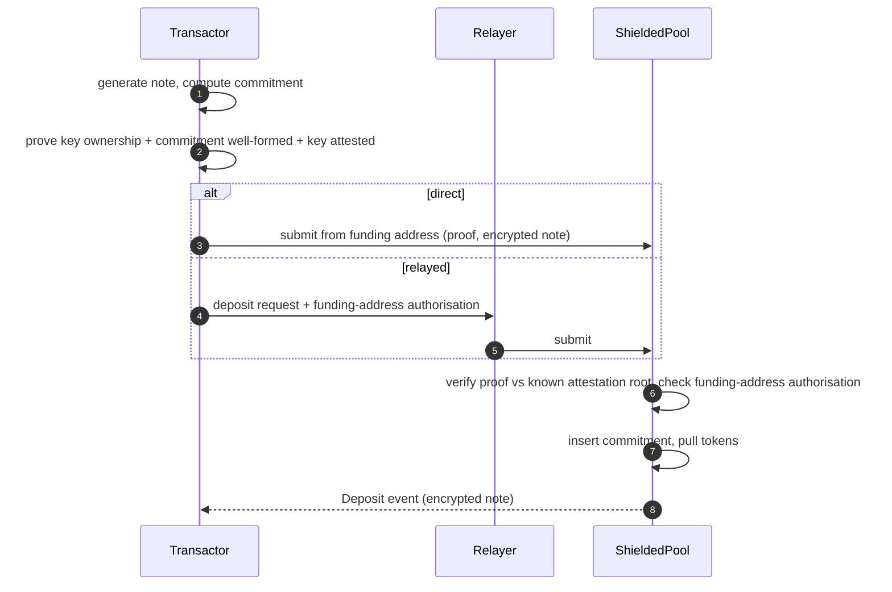
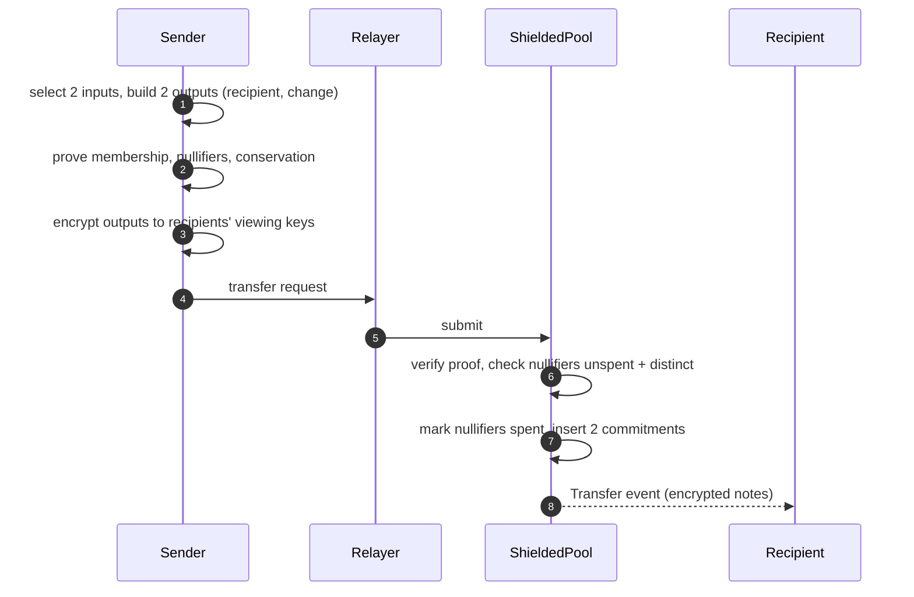
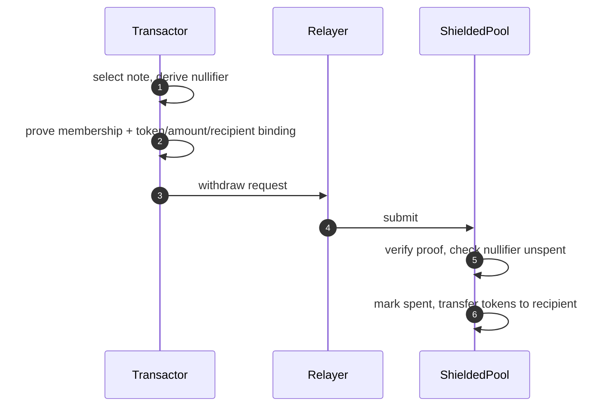

This document specifies an attestation-gated shielded pool for confidential ERC-20 payments on Ethereum. Only participants holding an eligibility attestation can enter the pool. Inside the pool, funds exist as private notes, committed on-chain and spent via nullifiers, hiding transfer amounts and counterparties from public observers, while viewing keys enable selective disclosure to auditors and regulators. The result is confidential payments between attested institutions, with entry cryptographically gated.

## 1. Introduction

### 1.1 Motivation

Institutional payment flows on public blockchains expose sensitive operational data: treasury positions and movement patterns, supplier relationships through payment destinations, settlement timing that reveals trading strategies, and aggregated on-chain data that enables competitor analysis. Institutions require payment privacy comparable to traditional banking while operating on public infrastructure.

Consumer-focused privacy protocols do not meet these requirements: they admit anonymous participants, which most regulated institutions cannot accept for their own transacting. This protocol inverts the default. Entry requires a zero-knowledge proof of an eligibility attestation, and every participant holds a viewing key that can be disclosed to an auditor without surrendering spending authority.

### 1.2 Constraints

- Privacy: for in-pool transfers, amounts, counterparties, and payment linkage MUST be hidden from public observers. Deposit and withdrawal amounts, tokens, and withdrawal recipients are public. Transaction existence remains visible.
- Regulatory: only attested participants can enter the pool. Viewing keys MUST enable selective disclosure for audit and monitoring. Appendix A records the legal obligations these mechanisms serve.
- Operational: settlement in minutes. Compatible with existing ERC-20 tokens without issuer modifications. Deployable on Ethereum L1.
- Trust: relayers MUST NOT be able to steal funds or to link a note's input to its output; they do observe submission metadata (Section 6.1). A compliance authority MUST NOT be able to act for parties it has not attested. Viewing-key holders get read-only access.

### 1.3 Relationship to Existing Standards

- Zcash Sapling/Orchard define both the note-commitment-nullifier shielded pool model and the dual-key separation of spending and viewing authority that this protocol builds on, but target a native asset on a dedicated chain with no participation gating.
- Tornado Cash, Railgun, and Privacy Pools bring shielded pools to Ethereum. Railgun's Private Proofs of Innocence screen funds after entry: a user proves non-membership in a blocklist, and relayers check the proof off-chain. Privacy Pools generalizes this to association sets: a user proves membership in any published set, inclusion or exclusion, and the proof is verified on-chain at withdrawal. Both screen funds; this specification screens participants: entry requires an identity attestation, checked in-circuit.
- Zeto (Hyperledger) is the closest prior design: its transfer templates check sender and receivers against an identities root in-circuit. This specification differs in its explicit attestation registry semantics (expiry, revocation, authorized attesters), its dual-key selective-disclosure model, and its published extension points for compliance monitoring and nullifier scaling.
- ERC-3643 defines permissioned-token compliance semantics for transparent tokens; this protocol provides the analogous boundary inside a shielded pool.

No open specification combines attestation-registry semantics (expiry, revocation, authorized attesters) with dual-key selective disclosure for a shielded pool on Ethereum L1. That is the gap this document fills. Protocol-relevant parts may later be upstreamed as an ERC; this document is the working specification.

### 1.4 Control Profile

Ethereum is permissionless. The base layer applies no control over who transacts. A confidential system built on it adds the control its trust context needs, and no more. This document calls that dimension the control axis and specifies one point on it.

A shielded pool has three reference points:

| Control | What it adds over the permissionless base | Specification |
|---|---|---|
| None (sovereign) | Nothing: anyone deposits, transfers, and withdraws | A separate specification, not written here |
| Entry (attested) | Only attested keys may deposit; in-pool transfer and withdrawal stay open | This specification |
| Flow (monitored) | Entry control, plus in-pool policy and an audit channel | The compliance-monitoring extension (Section 7.2) |

The three points share one pool core. The note, commitment, nullifier, and conservation machinery of Sections 4 and 5 is identical across them. They differ only in the membership and disclosure checks above that core.

Which point fits follows the trust context, along the i2i and i2u distinction the map draws for the [shielding pattern](https://github.com/ethsystems/map/blob/master/patterns/pattern-shielding.md). Between institutions (i2i), the participants are peers with legal recourse, and entry control defines a membership rather than a censor: it excludes no party the members did not agree to exclude. For a service to end users (i2u), entry control concentrates power in an operator who can exclude a user, so credible neutrality and a working exit weigh more. This document specifies the entry-control point for the institution-to-institution context. It names its neighbors so an implementer sees the whole axis, and specifies only itself.

### 1.5 Out of Scope

- Network-layer metadata: IP addresses, submission timing, and gas-payer identity are out of scope for the shielding layer. Deployments SHOULD compose network-level anonymity to cover them. Application-payload metadata is not covered: an anonymizing transport cannot remove a linkable identifier that the delivery payload itself carries (Section 5.4).
- State-read metadata: fetching a note's Merkle path or scanning for incoming notes through shared RPC or indexer infrastructure reveals to that operator which note is about to be spent or read. Out of scope here; addressed by the nullifier-scaling extension (private information retrieval, PIR), or sidestepped by institutions running their own node and indexer.
- Assets other than ERC-20: the mechanics generalize to any transferable asset, but this specification scopes to ERC-20.
- Multi-asset atomic settlement (PvP/DvP): transfers are single-token by construction (Section 5.3). Atomic two-asset settlement is a planned extension, not part of this core.
- In-pool flow monitoring and policy enforcement: specified by the compliance-monitoring extension (Section 7.2).

## 2. Conventions and Terminology

The key words "MUST", "MUST NOT", "REQUIRED", "SHALL", "SHALL NOT", "SHOULD", "SHOULD NOT", "RECOMMENDED", "MAY", and "OPTIONAL" in this document are to be interpreted as described in BCP 14 [RFC 2119](https://www.rfc-editor.org/info/rfc2119) [RFC 8174](https://www.rfc-editor.org/info/rfc8174) when, and only when, they appear in all capitals.

- **Note**: a private representation of token ownership: token, amount, owner public key, and salt.
- **Commitment**: a hash of a note, published on-chain without revealing note contents.
- **Nullifier**: a unique value derived from a commitment and its owner's spending key; publishing it spends the note.
- **Shielding / unshielding**: converting public ERC-20 tokens into a note (deposit), and back (withdraw).
- **Spending key**: the private key that authorizes spending notes and derives nullifiers.
- **Viewing key**: the private key that decrypts notes for read-only access; the selective-disclosure capability.
- **Attestation**: a compliance authority's on-chain statement that a spending public key belongs to an entity that passed its eligibility checks (typically KYC/KYB). The mechanism is policy-agnostic: what the attester verified is off-chain policy, not protocol.
- **KYC / KYB**: know-your-customer / know-your-business: identity and beneficial-ownership verification of persons and entities, performed off-chain by the compliance authority.
- **Sender / recipient**: transfer-local roles of transactors: the sender spends input notes; a recipient owns an output note.
- **Ballast note**: a zero-value note padding a transfer's second input slot. Constrained like a real input except for Merkle inclusion (Section 5.3).
- **Commitment tree**: the append-only Merkle tree of all note commitments.
- **Attestation tree**: the Merkle tree of attestations; enables proving compliance membership without revealing identity.
- **Relayer**: a party submitting transactions on behalf of transactors, paying gas and providing submission-timing privacy.
- **Transactor / subject**: an institutional participant transacting in the pool, identified by its attested spending public key.

`PoseidonN` denotes the Poseidon hash over BN254 at arity N. Each argument count MUST instantiate a distinct permutation width with its own round constants. An implementation MUST NOT realize a lower arity by zero-padding into a wider permutation: `Poseidon(a, b)` would then merge with `Poseidon(a, b, 0, 0)`, and internal Merkle-tree nodes would open as notes. Arity separation does not separate same-arity uses: note commitments and attestation leaves are both Poseidon4. No confusion is reachable in the two-tree design, since a prover cannot insert into the attestation tree, but a per-use domain tag is reserved (Section 6.3) and MUST be pinned before any shared-tree or shared-code variant.

## 3. Architecture

### 3.1 Participants and Roles

| Role | Description | Keys held |
|------|-------------|-----------|
| Transactor | Institutional user performing shielded payments | Spending key, viewing key |
| Relayer | Submits transactions on behalf of transactors | Relayer signing key |
| Compliance authority (attester) | Issues KYC attestations to verified participants | Attestation issuance authority |
| Regulator / auditor | Observer granted viewing keys for audit | Granted viewing keys |

### 3.2 Trust Model

- A public observer sees all on-chain data: commitments, nullifiers, tree roots, transaction existence and timing. It learns neither transfer amounts, nor owners, nor the link between a spent note and its commitment.
- A relayer can delay, reorder, or refuse transactions. It cannot steal funds or produce valid proofs; a transactor can switch relayers or submit directly.
- A viewing-key holder reads all notes addressed to that key, past and future. It cannot spend.
- A compliance authority can attest and revoke transactors. It cannot move funds. A malicious authority can admit unauthorized parties; authorization of attesters is therefore a governance decision (see Section 6.3).
- The proving system is trusted for soundness and for zero knowledge: soundness underwrites every integrity guarantee, zero knowledge underwrites confidentiality and unlinkability. The hash function is trusted for collision and preimage resistance. The contract owner's powers are enumerated and constrained per Section 6.1.

### 3.3 Overview

The protocol composes four mechanisms:

1. **Attestation-gated entry.** A deposit MUST carry a zero-knowledge proof that the depositor's spending public key is in the on-chain attestation tree.
2. **UTXO notes** (unspent-transaction-output model)**.** Funds exist as note commitments in an append-only Merkle tree, spent by publishing nullifiers. Transfers consume input notes and create output notes with no public link between them.
3. **Dual-key selective disclosure.** The spending key authorizes transfers; a separate viewing key decrypts notes. Institutions can hand a viewing key to an auditor without surrendering custody.
4. **Relayer abstraction.** Third parties submit transactions, decoupling gas payment and submission metadata from the transacting institution. Relayer use is OPTIONAL: any transactor MAY submit directly. A transactor that submits directly pays gas from its own address, which publicly links that address to the pool operation and forfeits entry-to-exit unlinkability.

The attestation gate is architecturally separable: it is a membership check inside the deposit statement. An ungated profile of this pool is out of scope: this specification targets institutional deployments, which require the gate.

Two extension points are explicitly reserved, each specified separately and composing with this core: a compliance-monitoring layer that evaluates policy in-circuit on every transaction (in-pool flow monitoring, aggregation, audit channels), and a nullifier-scaling layer (epoch nullifiers, private state reads). See Section 7.

### 3.4 Protocol Phases

1. Attestation: a compliance authority verifies a participant off-chain and records an attestation on-chain.
2. Deposit: the participant shields ERC-20 tokens into a note, proving attestation membership.
3. Transfer: participants pay each other inside the pool, unlinkably.
4. Withdraw: a participant unshields a note back to a public ERC-20 balance.
5. Audit: a viewing key discloses a participant's notes to an authorized reader.

## 4. Protocol Operations

### 4.1 Attestation Issuance

1. [transactor] Submit KYC/KYB documentation to the compliance authority (off-chain).
2. [attester] Verify the transactor's identity per institutional and regulatory requirements (off-chain).
3. [attester] Call the registry with the subject's spending public key and an expiry time.
4. [registry] Compute the attestation leaf (Section 5.1) binding subject, attester, issuance time, and expiry; the registry MUST compute the leaf itself rather than accept a precomputed one.
5. [registry] Insert the leaf into the attestation tree and emit an event carrying the leaf, subject key hash, attester, and validity window.
6. [transactor] Index the event to learn the leaf position, enabling Merkle inclusion proofs for deposits.

The registry MUST reject attestation issuance from addresses that governance has not authorized.

The registry's subject argument is `owner_pubkey` itself. An implementation MUST NOT apply a further hash layer: the resulting leaves would open in no circuit, and the pool would be unprovable for every party.

### 4.2 Attestation Revocation

1. [attester] On KYC expiry, a sanctions match, or regulator direction, compute the Merkle path for the target leaf.
2. [attester] Call the registry to revoke the leaf.
3. [registry] Mark the leaf revoked, remove it from the tree (updating the root), and emit a revocation event.

An attester MUST be able to revoke only leaves carrying its own `attester` field; broader revocation MUST be governance-gated. Without this bound, any authorized attester can revoke every leaf, and under the fresh-gate rule (Section 4.6) one rogue or key-compromised attester halts all deposits pool-wide. A removed leaf MUST be replaced by the field-zero value, which has no Poseidon4 preimage a prover can open.

After revocation the participant cannot produce inclusion proofs against the updated root, preventing new deposits. Notes already in the pool remain spendable; this protocol does not freeze in-pool funds. Deployments that require post-entry controls compose the compliance-monitoring extension (Section 7.3).

Revocation makes the attestation tree non-monotone: each revocation invalidates in-flight proofs built against older roots, and the fresh-gate rule (Section 4.6) is what makes revocation effective. The compliance-monitoring extension replaces removal with short-lived attestations and re-issuance to keep the tree append-only; a deployment of this core MAY adopt the same discipline.

### 4.3 Deposit (Shielding)



1. [transactor] Generate a note (token, amount, own spending public key, fresh random salt) and compute its commitment.
2. [transactor] Generate a proof for the deposit statement (Section 5.3): the depositor owns the spending key (`owner_pubkey == Poseidon1(spending_key)`), the commitment is well-formed over the deposited token and amount, and that key is attested.
3. [transactor] Approve the ERC-20 transfer and submit the deposit from the funding address, or sign a deposit authorisation and send it to a relayer.
4. [relayer] Submit the transaction, if a relayer is used.
5. [contract] Verify the proof against a known attestation root and check that the funding address authorised the deposit (Section 5.3); on failure, revert.
6. [contract] Append the commitment to the commitment tree, emit a deposit event carrying the encrypted note, and transfer tokens from the funding address into the pool. Insertion and event precede the external call, per Section 4.6.

### 4.4 Private Transfer

Transfers are 2-input-2-output; this shape is normative for this core, and variable arity is a future extension. A transfer with one real input pads the second with a ballast note (a zero-value note).



1. [sender] Select two input notes (padding with a ballast note if needed) and create two output notes: recipient and change. Every created or padded note MUST carry a fresh random salt.
2. [sender] Compute input nullifiers and output commitments, and generate a proof for the transfer statement (Section 5.3).
3. [sender] Encrypt each output note to its recipient's viewing key and send the request to a relayer. A recipient MUST NOT treat a note as received until its decrypted contents recompute to a commitment present on-chain; a garbled or fabricated payload otherwise credits a note that cannot be spent or that never existed.
4. [relayer] Submit the transaction.
5. [contract] Verify the proof; check both nullifiers are unspent and pairwise distinct; on failure, revert.
6. [contract] Mark the nullifiers spent, append both output commitments in public-input order (the tree is positional, so the order is normative), and emit a transfer event carrying the encrypted notes.

### 4.5 Withdraw (Unshielding)



1. [transactor] Select a note, compute its nullifier, and generate a proof for the withdraw statement (Section 5.3) binding token, amount, and recipient address.
2. [transactor] Send the request to a relayer (or submit directly).
3. [relayer] Submit the transaction.
4. [contract] Verify the proof; check the nullifier is unspent; on failure, revert.
5. [contract] Mark the nullifier spent, transfer tokens to the recipient address, and emit a withdraw event.

### 4.6 Contract-Side Requirements

- The contract MUST maintain a bounded window of historical commitment-tree roots and accept proofs against any root in the window. Accepting a historical root is sound because double-spending is prevented by the nullifier set, not by root freshness. A window of 100 roots is RECOMMENDED. The root recorded after the final insertion of each operation enters the window; intermediate roots do not.
- Deposit proofs MUST be verified against the current attestation root only (the fresh-gate rule). The historical-root window applies to the commitment tree, not the attestation tree: accepting a stale attestation root would re-admit revoked parties. Issuance and revocation change the current root and invalidate in-flight deposit proofs; clients retry against the new root.
- The contract MUST reject insertion of a commitment already present in the tree. Nullifiers are position-independent, so two identical commitments would share one nullifier and the second note would be unspendable.
- Deposits MUST require the token to be in the supported set; removing a token MUST NOT block transfers or withdrawals of existing notes. Tokens whose received amount can differ from the transfer argument (fee-on-transfer, rebasing) MUST NOT be supported: the pool accounts notes at face value, and a shortfall leaves the pool insolvent for the last withdrawer.
- Each operation's encrypted payload MUST be bound to its proof: the statement carries a payload commitment as the last public input (unconstrained in-circuit, like the withdraw recipient), and the contract MUST compute it from the submitted payload (Section 5.4) and pass that value to the verifier. Without the binding, a relayer can garble the payload: the operation lands, but the recipient never learns the note contents and the funds are unspendable.
- Deposits and withdrawals MUST reject `amount == 0`; zero-value operations are tree-growth griefing.
- The contract MUST reject any field-typed public input at or above the proof system's field modulus. Verifiers consume public inputs modulo the field, while the nullifier set is keyed by the raw encoding; without this check a prover submits `nullifier + p`, presenting the same field element to the verifier and an unseen key to the nullifier set, and double-spends.
- Commitment insertion MUST be reachable only from constrained mint sites: every insertion is asserted equal to a hash image over proof-constrained parts. Accepting an output commitment as a free witness breaks every property built on the tree.
- Every commitment insertion and the event announcing it MUST complete before any external call (such as the token transfer) in the same operation. Under a token with transfer hooks, a reentrant call can otherwise interleave insertions ahead of the outer call's event, permanently diverging log-order replay from the tree.
- All entry points MUST be non-reentrant.
- Events MUST carry enough data (commitments, nullifiers, encrypted notes) for a client to reconstruct the commitment tree and spent set from logs alone.

## 5. Data Formats

### 5.1 Data Structures

Key derivation:

```
spending_key    = random()
viewing_key     = random()
spending_pubkey = Poseidon1(spending_key)      // used in commitments and attestations
viewing_pubkey  = derive_pubkey(viewing_key)   // encrypted note delivery; secp256k1 in the reference implementation
```

Note, commitment, nullifier:

```
Note {
    token:        address   // ERC-20 token contract
    amount:       u128      // raw token units
    owner_pubkey: Field     // spending public key of owner
    salt:         Field     // fresh random value, hiding
}

commitment = Poseidon4(token, amount, owner_pubkey, salt)
nullifier  = Poseidon2(commitment, spending_key)
```

Only the spending-key holder can compute the nullifier, which spends the commitment without revealing which commitment was spent.

Attestation leaf:

```
AttestationLeaf {
    subject_pubkey: Field    // spending public key of attested party
    attester:       address  // compliance authority
    issued_at:      u64
    expires_at:     u64      // 0 = no expiry
}

attestation_leaf = Poseidon4(subject_pubkey, attester, issued_at, expires_at)
```

### 5.2 On-Chain State

- Commitment tree: an append-only incremental Merkle tree of note commitments, with a bounded historical-root window (Section 4.6).
- Nullifier set: a mapping from nullifier to spent status. Append-only.
- Attestation registry: a Merkle tree of attestation leaves, an authorized-attester set, and the current attestation root.
- Supported-token set and verifier reference, governed as Section 3.2 requires.

### 5.3 Proof Statements

In every circuit, `spending_key` MUST be a single witness variable feeding nullifier derivation, owner-key derivation, and attestation membership alike. Independent per-use equality constraints in this position are a historically shipped soundness bug.

Merkle proofs carry an explicit length and MUST range-check it against the tree's maximum depth. Proofs opened independently (the two transfer inputs) MUST NOT share one length.

Every amount witness in every statement MUST be range-checked to the note amount width (u128), and amount sums MUST use non-wrapping arithmetic. Conservation over unchecked field elements permits minting by modular overflow. The contract MUST reject any public amount at or above 2^128.

**Deposit statement.** Public, in this order: commitment, token, amount, funding address, attestation root, payload commitment. The proof attests:

1. `owner_pubkey == Poseidon1(spending_key)`
2. `commitment == Poseidon4(token, amount, owner_pubkey, salt)`
3. `attestation_leaf == Poseidon4(owner_pubkey, attester, issued_at, expires_at)`
4. The attestation leaf is a member of the tree at the public attestation root.

Constraint 1 restricts deposits to keys the depositor controls. Without it, the deposit witness is publicly reconstructible from registry events, and any party can generate an entry proof for any attested key.

The funding address is a public input bound to the proof but not constrained in-circuit. The contract MUST pull tokens only from the funding address bound in the proof, and MUST require that the funding address authorised this deposit: either `msg.sender == funding_address`, or a signature by the funding address over the deposit's public inputs, the chain id, and the pool address. An outstanding ERC-20 allowance alone is not authorisation: the proof shows only that the prover holds an attested key, and the funding address is a free public input, so any attested party could otherwise deposit against another address's allowance and mint a note it owns at that address's expense. The reference implementation uses the `msg.sender` form; relayed deposits require the signature form.

`expires_at` is bound into the leaf but not compared against current time in-circuit; enforcement of expiry is registry-side in this core (see Section 6.3 and the compliance-monitoring extension, which constrains it in-circuit).

**Transfer statement.** Public, in this order: two nullifiers, two output commitments, commitment root, payload commitment. The proof attests, with `owner_pubkey == Poseidon1(spending_key)`:

1. Each input commitment is well-formed over its note fields and `owner_pubkey`, and is a member of the tree at the public commitment root.
2. Each public nullifier equals `Poseidon2(commitment_in, spending_key)`.
3. Each output commitment is well-formed over its note fields.
4. Value conservation: the sum of input amounts equals the sum of output amounts.
5. Token consistency: all notes reference the same token.

For a ballast input (the padded zero-value note), the circuit MUST still constrain the commitment's shape and the nullifier's derivation under the sender's own spending key, and MUST skip only the Merkle inclusion check. Leaving a ballast nullifier unconstrained lets a prover mark arbitrary values spent. Whether an input is ballast MUST be derived in-circuit from `amount == 0`; a free selector witness would let a prover skip membership for a nonzero note. A ballast input carries the sender's own key, the transaction's token, and a fresh random salt.

**Withdraw statement.** Public, in this order: nullifier, token, amount, recipient, commitment root. The proof attests:

1. `owner_pubkey == Poseidon1(spending_key)`
2. `commitment == Poseidon4(token, amount, owner_pubkey, salt)` and the commitment is a member of the tree at the public commitment root.
3. `nullifier == Poseidon2(commitment, spending_key)`

`recipient` is a public input bound to the proof but not constrained in-circuit; the contract reads it to route funds. Withdraw carries no encrypted payload and therefore no payload commitment.

The public-input order above is normative: a verifier consumes the inputs positionally, and two implementations that disagree on the order cannot verify each other's proofs.

### 5.4 Cryptographic Profile

| Primitive | Instantiation | Usage |
|-----------|---------------|-------|
| Hash | Poseidon over BN254, distinct permutation per arity (Section 2) | Commitments, nullifiers, Merkle trees |
| Note encryption | ECDH + HKDF + AEAD (ChaCha20-Poly1305) over a fixed-length canonical plaintext | Encrypted note delivery to viewing keys |
| Merkle trees | LeanIMT (append-only, dynamic depth); commitment tree max depth 32, attestation tree max depth 20 | Membership proofs |
| Payload commitment | `keccak256(payload) mod p`, with `p` the BN254 scalar-field modulus, so the value is a canonical field element | Binding the encrypted payload to the proof (Section 4.6) |
| Proving system | UltraHonk (reference; any EVM-verifiable zk-SNARK with equivalent soundness MAY be substituted) | All proof statements |

Two conforming implementations MUST produce identical commitments, nullifiers, tree roots, and payload commitments for identical inputs; the hash and tree instantiations above are therefore normative for interoperability, while the proving system is a deployment choice. The payload commitment is computed over the exact bytes submitted on-chain; the reduction modulo `p` loses under two bits of the digest, which does not weaken the binding.

The note-encryption plaintext MUST be fixed-length and canonical, so a ciphertext's length reveals nothing about the note amount, and the note's commitment MUST be bound as associated data. The delivery payload MUST NOT carry a persistent linkable identifier such as the recipient's viewing public key: an anonymizing transport does not remove an application-layer identifier that ties a recipient to a specific on-chain commitment. The exact encoding is pinned in Section 7.4.

## 6. Security Considerations

### 6.1 Threat Model

| Adversary | Capabilities | Mitigation |
|-----------|--------------|------------|
| Public observer | Sees all on-chain state and traffic | Commitments hide note contents; nullifiers are unlinkable to commitments without the spending key |
| Malicious relayer | Delays, reorders, or refuses transactions; sees the submitted public data (proof, nullifiers, commitments, encrypted blobs) and the submitter's network identity, so it can link an IP to shielded activity | Cannot forge proofs, steal funds, or read note contents; payload binding (Section 4.6) prevents it from altering encrypted payloads; transactors switch relayers, run their own, or route through anonymizing transport |
| Compromised viewing key | Decrypts all notes for that key, past and future | Read-only; cannot spend. Distribution and rotation are deployment policy (see 6.3) |
| Malicious compliance authority | Attests unauthorized parties | Attester authorization is a governance decision; multi-party control RECOMMENDED |
| Network observer | Correlates submission metadata (IP, timing) | Out of scope for this layer; deployments SHOULD route submission through anonymizing transport |
| Contract owner / governance | With a mutable verifier, can install an accept-everything verifier and mint or drain the pool; controls attester authorization and supported tokens | A deployment MUST enumerate owner powers and put verifier changes behind a timelock and multi-party control, or make the verifier immutable and migrate by redeployment. Every guarantee in 6.2 is conditional on these controls |
| Viewing-key aggregator (auditor or regulator holding many transactors' keys) | Joins disclosed views into a cross-institution payment graph, including inferences about parties that granted nothing | Not mitigated in this core; epoch-scoped threshold disclosure in the compliance-monitoring extension bounds it |

### 6.2 Guarantees

Each guarantee is marked by its current verification level: asserted (designed for and reviewed, not verified), tested (covered by implementation tests), or machine-checked (formally proven). "Asserted" is a design claim, not a verified one: the level tracks the design, and each implementation additionally states which guarantees its own build satisfies. "Tested" names the reference implementation's tests (Section 7.1) that exercise the property, including its negative cases.

| Property | Statement | Level |
|----------|-----------|-------|
| Confidentiality | Note amounts and owners are hidden in commitments; revealed only via viewing key | asserted |
| Unlinkability | A transfer breaks the public link between input and output notes, among flows with indistinguishable amount and timing within the attested cohort (see 6.3) | asserted |
| No double-spend | A note spends at most once: nullifier uniqueness is enforced on-chain, and nullifier derivation is deterministic per note | asserted |
| Value conservation | No transfer creates or destroys value: input amounts equal output amounts in-circuit | tested |
| Compliance gating | Every deposit carries a valid attestation-membership proof; unattested parties cannot deposit | tested |
| Selective disclosure | A viewing key grants read access to the notes encrypted to it (incoming and change), without spending authority; see 6.3 for what it does not reveal | asserted |

### 6.3 Limitations

- The gate applies at entry only. Transfer outputs and withdrawals carry no attestation check, so an attested party can pay an unattested key that then withdraws. Expiry is not enforced in-circuit and the registry has no automatic sweep, so an expired-but-unrevoked attestation still admits deposits. Revocation prevents new deposits only; in-pool funds of a revoked party stay spendable. De-authorizing an attester does not invalidate leaves it already issued; recovery is per-leaf. Closed membership, in-circuit expiry, in-pool monitoring, and attester-scoped revocation all require the compliance-monitoring extension (Section 7.2).
- A single compliance authority is a single point of trust; production deployments SHOULD require multi-party attester governance.
- An auditor holding a transactor's viewing key sees incoming and change notes only: no spend status, no balances, and not whom the transactor paid. Sender-side transmittal records require the compliance-monitoring extension or out-of-band disclosure.
- Disclosure is unscoped, unlogged, and not revocable: nothing binds an owner key to one viewing key, a transactor may hold several, and a leaked key reads its notes forever, so audit completeness is not cryptographically guaranteed. A regulator holding many transactors' keys can join them into a cross-institution payment graph (Section 6.1). Epoch-scoped threshold disclosure with on-chain grant records is in the compliance-monitoring extension; richer viewing-key semantics are a planned specification.
- Deposit and withdrawal endpoints are transparent: the funding address, token, amount, and timing of every entry and exit are public. Unlinkability holds only among flows with indistinguishable amount and timing, so deployments SHOULD denominate or split entries and exits. Operation type, count, and timing per participant stay observable; batching and scheduled submission are deployment policy.
- The anonymity set is the attested cohort, publicly enumerable from registry events, so small cohorts give weak anonymity regardless of pool traffic. The registry also exposes which attester vouches for which key, renewal cadence, and revocation timing. A proof's commitment root reveals the tree state proved against, so clients SHOULD prove against the freshest windowed root.
- Note ciphertexts are public forever under classical primitives, so a future quantum adversary decrypts the whole pool history (harvest now, decrypt later); post-quantum or hybrid note encryption is a deployment-profile option.
- Commitments, nullifiers, and attestation leaves carry no chain or deployment separation; domain tags are reserved for a future revision, and until then clients MUST NOT reuse keys across deployments.
- The spending key is a raw field element with no signature capability, so hardware-module and threshold custody are nontrivial; signature-based note ownership is a candidate revision.
- The nullifier set grows without bound; the nullifier-scaling extension bounds active state via epoch nullifiers.

## 7. Implementation Notes

### 7.1 Reference Implementation

The reference implementation lives in [ethsystems/pocs](https://github.com/ethsystems/pocs) under `pocs/private-payment/shielded-pool/` (Noir circuits, Solidity contracts, Rust client). Its SPEC.md is the source this specification was promoted from. Known reference-implementation shortcuts an implementer MUST NOT copy into production: a single compliance authority, in-memory client-side Merkle trees, no deployed relayer network, u64 amounts in the circuits (the note declares u128), a deposit circuit that binds neither the spending key nor the funding address (Section 5.3), and no payload-commitment binding (Section 4.6).

### 7.2 Composition: Compliance Monitoring

The in-pool monitoring layer (per-transaction policy evaluation, per-epoch aggregation via compliance notes and velocity nullifiers, threshold-encrypted audit channel, in-circuit attestation expiry) is specified as an extension over this core; its current draft is `pocs/private-payment/shielded-pool-compliance/SPEC.md`, planned for promotion as a spec in this domain.

### 7.3 Composition: Nullifier Scaling and Private State Reads

Epoch-based nullifiers, per-note chain proofs, and PIR-served state reads are specified as an extension over this core; its current draft is `pocs/private-payment/shielded-pool-extension/SPEC.md`.

### 7.4 Interop Surface Not Yet Specified

The following are unspecified at raw status. A single-implementation deployment pins each by reference to the reference implementation; independent implementations require them. They do not by themselves gate draft status: the draft gate is a reference implementation conforming to the normative requirements of Sections 4.6 and 5.3, plus the adversarial review (1/COSS).

- Note encryption: curve and point encodings, ephemeral-key scheme, HKDF inputs and info string, and nonce rule. The fixed-length canonical plaintext, the commitment-as-associated-data binding, and the exclusion of persistent linkable identifiers are already normative (Section 5.4); what remains here is pinning the concrete encoding.
- Event ABI and the note-discovery procedure. The recompute-to-commitment check before a note counts as received is already normative (Section 4.4); what remains here is the event schema and the discovery walk.
- A shielded address format binding the owner public key and viewing public key, with versioning and a checksum.
- Poseidon parameter pinning per arity (constants source, round numbers), the tree's node-hash rules, and test vectors for commitment, nullifier, leaf, and root.
- Type-to-field embeddings for addresses, amounts, and timestamps.
- The attestation registry function surface, revocation access control (which attester may revoke which leaf), and the value that replaces a removed leaf.
- Relayer compensation. No in-protocol fee exists; out-of-band payment re-links the transactor's identity to its submissions and defeats the relayer's purpose.

## 8. References

Normative:

- [RFC 2119](https://www.rfc-editor.org/info/rfc2119), [RFC 8174](https://www.rfc-editor.org/info/rfc8174)
- [ERC-20 Token Standard](https://eips.ethereum.org/EIPS/eip-20)
- [Poseidon Hash Function](https://www.poseidon-hash.info/)
- [LeanIMT (zk-kit)](https://github.com/privacy-scaling-explorations/zk-kit/tree/main/packages/lean-imt)

Informative:

- [Zcash Protocol Specification (Sapling, Orchard)](https://zips.z.cash/protocol/protocol.pdf)
- [Railgun](https://docs.railgun.org/), [Railgun Private Proofs of Innocence](https://docs.railgun.org/wiki/assurance/private-proofs-of-innocence), [Privacy Pools](https://eprint.iacr.org/2023/1156), [Zeto](https://github.com/hyperledger-labs/zeto), [ERC-3643](https://eips.ethereum.org/EIPS/eip-3643)
- [Noir](https://noir-lang.org/docs/), [zk-kit.noir](https://github.com/privacy-scaling-explorations/zk-kit.noir)
- EthSystems Map: [shielding pattern](https://github.com/ethsystems/map/blob/master/patterns/pattern-shielding.md), [private-stablecoins use case](https://github.com/ethsystems/map/blob/master/use-cases/private-stablecoins.md), [private-payments approach](https://github.com/ethsystems/map/blob/master/approaches/approach-private-payments.md)
- Reference implementation: [ethsystems/pocs](https://github.com/ethsystems/pocs), `pocs/private-payment/shielded-pool/`

## Appendix A. Regulatory Context (non-normative)

The compliance mechanisms in this protocol exist because specific legal obligations require them, not as discretionary features. This appendix records that tie. It is non-normative: which obligations bind a deployment depends on jurisdiction, licensing, and the deploying party's role. Jurisdiction specifics are maintained in the [map jurisdictions registry](https://github.com/ethsystems/map/tree/master/jurisdictions); the per-control mapping for in-pool monitoring is Appendix A of the compliance-monitoring extension.

| Mechanism | Obligation served | Representative instruments |
|---|---|---|
| Attestation-gated entry (4.1, 4.3) | Customer due diligence and identification before providing service: KYC for natural persons, KYB and beneficial ownership for entities | [FATF R.10](https://www.fatf-gafi.org/en/publications/Fatfrecommendations/Fatf-recommendations.html); [31 CFR 1020.220](https://www.law.cornell.edu/cfr/text/31/1020.220) (customer identification); [31 CFR 1010.230](https://www.law.cornell.edu/cfr/text/31/1010.230) (beneficial ownership); EU AMLR [(EU) 2024/1624](https://eur-lex.europa.eu/eli/reg/2024/1624/oj) |
| Attestation expiry and revocation (4.2) | Ongoing due diligence through the business relationship; acting on sanctions designations | FATF R.10(d); [31 CFR Part 501](https://www.law.cornell.edu/cfr/text/31/part-501) and equivalents |
| Encrypted notes plus viewing keys (3.3, 5.4) | Recordkeeping, and producing records of received payments to competent authorities on lawful request. Sender-side transmittal records (FATF R.16, [31 CFR 1010.410](https://www.law.cornell.edu/cfr/text/31/1010.410), EU TFR [(EU) 2023/1113](https://eur-lex.europa.eu/eli/reg/2023/1113/oj)) require the compliance-monitoring extension | FATF R.11 |
| Composition seam: in-pool monitoring (7.2) | Transaction monitoring, same-day aggregation, suspicious-activity reporting | FATF R.20; [31 CFR 1020.320](https://www.law.cornell.edu/cfr/text/31/1020.320); [31 CFR 1010.313](https://www.law.cornell.edu/cfr/text/31/1010.313) |

Each row names the obligation family at its root instrument rather than secondary guidance. This appendix maps mechanisms to obligation families; it does not claim legal sufficiency and is not legal advice. A deployment records its own per-jurisdiction mapping with counsel; the map's jurisdiction cards are the registry for that mapping.

## Change Process

This document is governed by [1/COSS](../1).

## Copyright

This specification is released to the public domain under [CC0 1.0](../../LICENSE).
