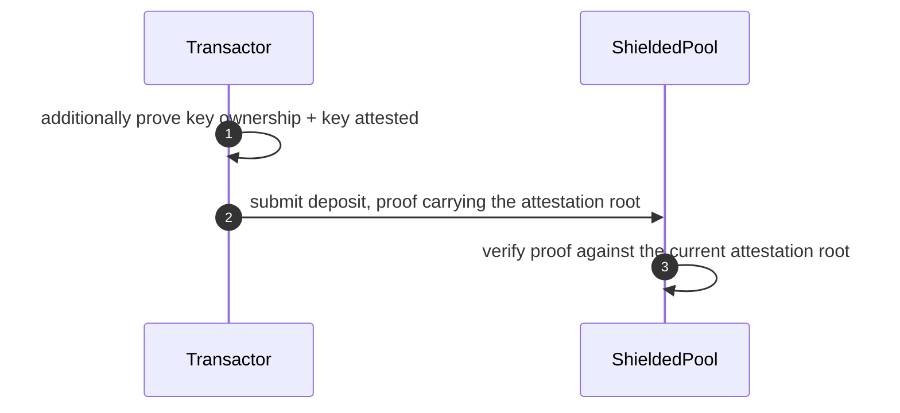

This document specifies attestation-gated entry to a shielded pool. It is a profile of [2/SHIELDED-POOL](../2): only a party holding an eligibility attestation may deposit, and the check is a zero-knowledge proof of membership in an on-chain attestation tree. Notes, commitments, nullifiers, transfers, withdrawals, and viewing keys are specified by 2/SHIELDED-POOL and are not restated here. The result is confidential payments between attested institutions, with entry cryptographically gated.

## 1. Introduction

### 1.1 Motivation

Consumer-focused privacy protocols admit anonymous participants, which most regulated institutions cannot accept for their own transacting. This profile inverts the default. Entry requires a zero-knowledge proof of an eligibility attestation, and every participant holds a viewing key that can be disclosed to an auditor without surrendering spending authority.

The gate is one membership check inside the deposit statement, and nothing under it depends on the gate. Specifying it as a profile rather than as a second pool keeps one set of machinery and one set of machinery test vectors across the gated and ungated cases.

### 1.2 Constraints

The constraints of 2/SHIELDED-POOL Section 1.2 apply, as does the control-profile framing of its Section 1.4. Its out-of-scope list (2/SHIELDED-POOL Section 1.5) applies except for entry control, which is the subject of this document; in-pool flow control stays out of scope. This profile adds two constraints:

- Regulatory: only attested participants can enter the pool. Appendix A records the legal obligations these mechanisms serve.
- Trust: a compliance authority MUST NOT be able to act for parties it has not attested.

### 1.3 Relationship to Existing Standards

- Zeto (Hyperledger) is the closest prior design: its transfer templates check sender and receivers against an identities root in-circuit. This profile differs in gating entry rather than every transfer, and in its explicit attestation registry semantics: expiry, revocation, and authorized attesters.
- ERC-3643 defines permissioned-token compliance semantics for transparent tokens; this profile provides the analogous boundary around a shielded pool.
- Railgun's Private Proofs of Innocence and Privacy Pools' association sets screen funds, after entry and at exit respectively. This profile screens participants, at entry. 2/SHIELDED-POOL Appendix A places these systems on that axis.

No open specification combines attestation-registry semantics (expiry, revocation, authorized attesters) with dual-key selective disclosure for a shielded pool on Ethereum L1. That is the gap this document fills. Protocol-relevant parts may later be upstreamed as an ERC; this document is the working specification.

## 2. Conventions and Terminology

The key words "MUST", "MUST NOT", "REQUIRED", "SHALL", "SHALL NOT", "SHOULD", "SHOULD NOT", "RECOMMENDED", "MAY", and "OPTIONAL" in this document are to be interpreted as described in BCP 14 [RFC 2119](https://www.rfc-editor.org/info/rfc2119) [RFC 8174](https://www.rfc-editor.org/info/rfc8174) when, and only when, they appear in all capitals.

The terminology of 2/SHIELDED-POOL Section 2 applies. This profile adds:

- **Attestation**: a compliance authority's on-chain statement that a spending public key belongs to an entity that passed its eligibility checks (typically KYC/KYB). The mechanism is policy-agnostic: what the attester verified is off-chain policy, not protocol.
- **KYC / KYB**: know-your-customer / know-your-business: identity and beneficial-ownership verification of persons and entities, performed off-chain by the compliance authority.
- **Attestation tree**: the Merkle tree of attestations; enables proving compliance membership without revealing identity.
- **Subject**: the transactor an attestation is issued to, identified by its attested spending public key.

Note commitments and attestation leaves are both Poseidon4, so this profile adds a second same-arity use and a second tree, and inherits the domain-separation concern of 2/SHIELDED-POOL Section 2. No confusion is reachable in the two-tree design, since a prover cannot insert into the attestation tree, but the per-use domain tag reserved there MUST be pinned before any shared-tree or shared-code variant.

## 3. Architecture

### 3.1 Participants and Roles

The roles of 2/SHIELDED-POOL Section 3.1 apply, plus:

| Role | Description | Keys held |
|------|-------------|-----------|
| Compliance authority (attester) | Issues KYC attestations to verified participants | Attestation issuance authority |

### 3.2 Trust Model

The trust model of 2/SHIELDED-POOL Section 3.2 applies, plus:

- A compliance authority can attest and revoke transactors. It cannot move funds. A malicious authority can admit unauthorized parties; authorization of attesters is therefore a governance decision (see Section 6.3).

### 3.3 Overview

This profile adds one mechanism to the three of 2/SHIELDED-POOL Section 3.3:

- **Attestation-gated entry.** A deposit MUST carry a zero-knowledge proof that the depositor's spending public key is in the on-chain attestation tree.

It instantiates three of the extension points of 2/SHIELDED-POOL Section 5.5: E1, the deposit-statement conjunct that proves key ownership and attestation membership (Section 5.3); E3, the attestation registry those constraints read (Section 5.2); and E4, the attestation root as a public input (Section 5.3). E2 is not instantiated: in-pool transfers carry no attestation check under this profile, and the transfer and withdraw statements of 2/SHIELDED-POOL apply unchanged.

The protocol phases of 2/SHIELDED-POOL Section 3.4 apply, preceded by attestation: a compliance authority verifies a participant off-chain and records an attestation on-chain. The deposit phase then additionally proves attestation membership.

## 4. Protocol Operations

### 4.1 Attestation Issuance

1. [transactor] Submit KYC/KYB documentation to the compliance authority (off-chain).
2. [attester] Verify the transactor's identity per institutional and regulatory requirements (off-chain).
3. [attester] Call the registry with the subject's spending public key and an expiry time.
4. [registry] Compute the attestation leaf (Section 5.1) binding subject, attester, issuance time, and expiry; the registry MUST compute the leaf itself rather than accept a precomputed one.
5. [registry] Insert the leaf into the attestation tree and emit an event carrying the leaf, subject key hash, attester, and validity window.
6. [transactor] Index the event to learn the leaf position, enabling Merkle inclusion proofs for deposits.

The registry MUST reject attestation issuance from addresses that governance has not authorized.

The registry's subject argument is `owner_pubkey` itself. An implementation MUST NOT apply a further hash layer: the resulting leaves would open in no circuit, and the pool would be unprovable for every party.

### 4.2 Attestation Revocation

1. [attester] On KYC expiry, a sanctions match, or regulator direction, compute the Merkle path for the target leaf.
2. [attester] Call the registry to revoke the leaf.
3. [registry] Mark the leaf revoked, remove it from the tree (updating the root), and emit a revocation event.

An attester MUST be able to revoke only leaves carrying its own `attester` field; broader revocation MUST be governance-gated. Without this bound, any authorized attester can revoke every leaf, and under the fresh-gate rule (Section 4.4) one rogue or key-compromised attester halts all deposits pool-wide. A removed leaf MUST be replaced by the field-zero value, which has no Poseidon4 preimage a prover can open.

After revocation the participant cannot produce inclusion proofs against the updated root, preventing new deposits. Notes already in the pool remain spendable; this protocol does not freeze in-pool funds. Deployments that require post-entry controls compose the compliance-monitoring extension (Section 7.2).

Revocation makes the attestation tree non-monotone: each revocation invalidates in-flight proofs built against older roots, and the fresh-gate rule (Section 4.4) is what makes revocation effective. The compliance-monitoring extension replaces removal with short-lived attestations and re-issuance to keep the tree append-only; a deployment of this profile MAY adopt the same discipline.

### 4.3 Deposit (Shielding)

The deposit flow of 2/SHIELDED-POOL Section 4.1 applies, with the gate added at two steps:



1. [transactor] At step 2 of that flow, the proof additionally attests that the depositor owns the spending key and that the key is attested (Section 5.3). The note's owner key is therefore the depositor's own; shielding straight to another party's key is not available under this profile.
2. [contract] At step 5, verify the proof against the current attestation root (Section 4.4) as well as the funding-address authorisation.

### 4.4 Contract-Side Requirements

The requirements of 2/SHIELDED-POOL Section 4.4 apply, plus:

- Deposit proofs MUST be verified against the current attestation root only (the fresh-gate rule). The historical-root window applies to the commitment tree, not the attestation tree: accepting a stale attestation root would re-admit revoked parties. Issuance and revocation change the current root and invalidate in-flight deposit proofs; clients retry against the new root.

## 5. Data Formats

### 5.1 Data Structures

The structures of 2/SHIELDED-POOL Section 5.1 apply, plus the attestation leaf:

```
AttestationLeaf {
    subject_pubkey: Field    // spending public key of attested party
    attester:       address  // compliance authority
    issued_at:      u64
    expires_at:     u64      // 0 = no expiry
}

attestation_leaf = Poseidon4(subject_pubkey, attester, issued_at, expires_at)
```

### 5.2 On-Chain State

The state of 2/SHIELDED-POOL Section 5.2 applies, plus:

- Attestation registry: a Merkle tree of attestation leaves, an authorized-attester set, and the current attestation root.

### 5.3 Proof Statements

The transfer and withdraw statements of 2/SHIELDED-POOL Section 5.3 apply unchanged. The deposit statement gains the E1 conjunct and the E4 public input.

**Deposit statement.** Public, in this order: commitment, token, amount, funding address, attestation root, payload commitment. The attestation root is inserted after the funding address, so the payload commitment stays last, as Section 5.5 of that document requires. The proof attests:

1. `owner_pubkey == Poseidon1(spending_key)`
2. `commitment == Poseidon4(token, amount, owner_pubkey, salt)`
3. `attestation_leaf == Poseidon4(owner_pubkey, attester, issued_at, expires_at)`
4. The attestation leaf is a member of the tree at the public attestation root.

Constraint 2 is the base statement of 2/SHIELDED-POOL. Constraints 1, 3, and 4 are the E1 conjunct.

Constraint 1 restricts deposits to keys the depositor controls. Without it, the deposit witness is publicly reconstructible from registry events, and any party can generate an entry proof for any attested key. It also removes the shield-to-recipient case that the core permits, which is the intended narrowing: under this profile a note enters the pool only under an attested key.

The single-witness rule of 2/SHIELDED-POOL Section 5.3 extends to this statement: `spending_key` MUST be one witness variable feeding owner-key derivation and attestation membership alike. Independent per-use equality constraints in this position are a historically shipped soundness bug.

`expires_at` is bound into the leaf but not compared against current time in-circuit; enforcement of expiry is registry-side in this profile (see Section 6.3 and the compliance-monitoring extension, which constrains it in-circuit).

### 5.4 Cryptographic Profile

The profile of 2/SHIELDED-POOL Section 5.4 applies, plus the registry parameters of E3:

| Primitive | Instantiation | Usage |
|-----------|---------------|-------|
| Attestation tree | LeanIMT (dynamic depth), max depth 20; a revoked leaf is updated to the field-zero value (Section 4.2), so this tree is not append-only | Attestation membership proofs |
| Attestation leaf | Poseidon4 over BN254 | Binding subject, attester, and validity window |

The Merkle proof-length range check of 2/SHIELDED-POOL Section 5.3 is per-tree: an attestation proof range-checks against depth 20, a commitment proof against depth 32. Two conforming implementations of this profile MUST produce identical attestation leaves and attestation roots for identical inputs.

## 6. Security Considerations

### 6.1 Threat Model

The threat model of 2/SHIELDED-POOL Section 6.1 applies, plus:

| Adversary | Capabilities | Mitigation |
|-----------|--------------|------------|
| Malicious compliance authority | Attests unauthorized parties | Attester authorization is a governance decision; multi-party control RECOMMENDED |
| Viewing-key aggregator (auditor or regulator holding many transactors' keys) | Joins disclosed views into a cross-institution payment graph, including inferences about parties that granted nothing | Not mitigated in this profile; epoch-scoped threshold disclosure in the compliance-monitoring extension bounds it |

The contract owner additionally controls attester authorization, alongside the powers listed in that section.

### 6.2 Guarantees

The guarantees of 2/SHIELDED-POOL Section 6.2 hold under this profile, with one addition and one narrowing. Verification levels have the meaning given there.

| Property | Statement | Level |
|----------|-----------|-------|
| Compliance gating | Every deposit carries a valid attestation-membership proof; unattested parties cannot deposit | tested |
| Unlinkability | A transfer breaks the public link between input and output notes, among flows with indistinguishable amount and timing within the attested cohort (see 6.3) | asserted |

### 6.3 Limitations

The limitations of 2/SHIELDED-POOL Section 6.3 apply, except where an item below replaces one. This profile adds:

- The gate applies at entry only. Transfer outputs and withdrawals carry no attestation check, so an attested party can pay an unattested key that then withdraws. Expiry is not enforced in-circuit and the registry has no automatic sweep, so an expired-but-unrevoked attestation still admits deposits. Revocation prevents new deposits only; in-pool funds of a revoked party stay spendable. De-authorizing an attester does not invalidate leaves it already issued; recovery is per-leaf. Closed membership, in-circuit expiry, and in-pool monitoring all require the compliance-monitoring extension (Section 7.2).
- A single compliance authority is a single point of trust; production deployments SHOULD require multi-party attester governance.
- The anonymity set is the attested cohort, publicly enumerable from registry events, so small cohorts give weak anonymity regardless of pool traffic. The registry also exposes which attester vouches for which key, renewal cadence, and revocation timing. This replaces the anonymity-set claim of 2/SHIELDED-POOL Section 6.3, which describes an open pool; the root-freshness advice in that section still applies.
- Attestation leaves carry no chain or deployment separation, on the same terms as commitments and nullifiers in 2/SHIELDED-POOL Section 6.3.

## 7. Implementation Notes

### 7.1 Reference Implementation

The reference implementation of 2/SHIELDED-POOL Section 7.1 is a deployment of this profile: [ethsystems/pocs](https://github.com/ethsystems/pocs) under `pocs/private-payment/shielded-pool/`. It conforms to 2/SHIELDED-POOL under this profile, and its SPEC.md is the source both documents were promoted from. Draft status (1/COSS) rests on that implementation and on the adversarial review of the gated specification and of the implementation against it. Known shortcuts an implementer MUST NOT copy into production: a single compliance authority, and in-memory client-side attestation trees.

### 7.2 Composition: Compliance Monitoring

In-pool monitoring is intended as a separate specification building on this entry profile, not an additional requirement of it.
Its current draft is `pocs/private-payment/shielded-pool-compliance/SPEC.md`, planned for promotion as a spec in this domain.
That draft covers policy evaluation on gated operations, per-epoch aggregation, a threshold-encrypted audit channel, and in-circuit attestation expiry.
Promotion requires reconciling its proof statements, state changes, and registry rules with both this profile and 2/SHIELDED-POOL Section 5.5.
This pointer does not establish conformance of the current PoC draft to either specification.

### 7.3 Interop Surface Not Yet Specified

The interop surface of 2/SHIELDED-POOL Section 7.4 applies. This profile adds one item, on the same terms: the attestation registry function surface, the revocation function signature and the governance path for broader revocation (the attester-scope rule of Section 4.2 is normative), and test vectors for the attestation leaf and root.

## 8. References

Normative:

- [RFC 2119](https://www.rfc-editor.org/info/rfc2119), [RFC 8174](https://www.rfc-editor.org/info/rfc8174)
- [2/SHIELDED-POOL](../2)
- [Poseidon Hash Function](https://www.poseidon-hash.info/)
- [LeanIMT (zk-kit)](https://github.com/privacy-scaling-explorations/zk-kit/tree/main/packages/lean-imt)

Informative:

- [Zeto](https://github.com/hyperledger-labs/zeto), [ERC-3643](https://eips.ethereum.org/EIPS/eip-3643)
- [Railgun Private Proofs of Innocence](https://docs.railgun.org/wiki/assurance/private-proofs-of-innocence), [Privacy Pools](https://eprint.iacr.org/2023/1156)
- EthSystems Map: [jurisdictions registry](https://github.com/ethsystems/map/tree/master/jurisdictions), [shielding pattern](https://github.com/ethsystems/map/blob/master/patterns/pattern-shielding.md)
- Reference implementation: [ethsystems/pocs](https://github.com/ethsystems/pocs), `pocs/private-payment/shielded-pool/`

## Appendix A. Regulatory Context (non-normative)

The compliance mechanisms in this profile exist because specific legal obligations require them, not as discretionary features. This appendix records that tie. It is non-normative: which obligations bind a deployment depends on jurisdiction, licensing, and the deploying party's role. Jurisdiction specifics are maintained in the [map jurisdictions registry](https://github.com/ethsystems/map/tree/master/jurisdictions); the per-control mapping for in-pool monitoring is Appendix A of the compliance-monitoring extension.

| Mechanism | Obligation served | Representative instruments |
|---|---|---|
| Attestation-gated entry (4.1, 4.3) | Customer due diligence and identification before providing service: KYC for natural persons, KYB and beneficial ownership for entities | [FATF R.10](https://www.fatf-gafi.org/en/publications/Fatfrecommendations/Fatf-recommendations.html); [31 CFR 1020.220](https://www.law.cornell.edu/cfr/text/31/1020.220) (customer identification); [31 CFR 1010.230](https://www.law.cornell.edu/cfr/text/31/1010.230) (beneficial ownership); EU AMLR [(EU) 2024/1624](https://eur-lex.europa.eu/eli/reg/2024/1624/oj) |
| Attestation expiry and revocation (4.2) | Ongoing due diligence through the business relationship; acting on sanctions designations | FATF R.10(d); [31 CFR Part 501](https://www.law.cornell.edu/cfr/text/31/part-501) and equivalents |
| Encrypted notes plus viewing keys (2/SHIELDED-POOL 3.3, 5.4) | Recordkeeping, and producing records of received payments to competent authorities on lawful request. Sender-side transmittal records (FATF R.16, [31 CFR 1010.410](https://www.law.cornell.edu/cfr/text/31/1010.410), EU TFR [(EU) 2023/1113](https://eur-lex.europa.eu/eli/reg/2023/1113/oj)) require the compliance-monitoring extension | FATF R.11 |
| Composition seam: in-pool monitoring (7.2) | Transaction monitoring, same-day aggregation, suspicious-activity reporting | FATF R.20; [31 CFR 1020.320](https://www.law.cornell.edu/cfr/text/31/1020.320); [31 CFR 1010.313](https://www.law.cornell.edu/cfr/text/31/1010.313) |

Each row names the obligation family at its root instrument rather than secondary guidance. This appendix maps mechanisms to obligation families; it does not claim legal sufficiency and is not legal advice. A deployment records its own per-jurisdiction mapping with counsel; the map's jurisdiction cards are the registry for that mapping.

## Change Process

This document is governed by [1/COSS](../1).

## Copyright

This specification is released to the public domain under [CC0 1.0](../../LICENSE).
